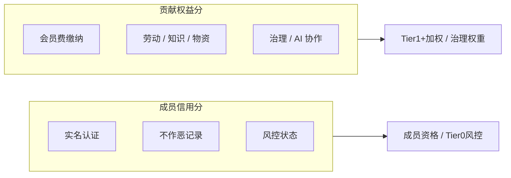

# P0 机制决议草案

> 日期：2026-06-13  
> 状态：**决议草案** — 供讨论与模拟验证，非最终定案  
> 依据：[张力与开放问题](../philosophy/tensions-and-open-questions.md) 讨论优先级 1–3、7

本文档闭合 Phase 1 前置设计所需的五个 P0 机制问题。闭合方式为「决议草案」：足够明确以支撑规则草案与推演模型，但仍可在试点前微调数值。

---

## 1. 必需品边界

**决议草案**

必需品采用**三层清单**，避免「必需」无限膨胀：

| 层级 | 定义 | 示例 | 资金用途 |
|------|------|------|----------|
| **核心必需（Tier 0 可兑换）** | 维持基本生存与最低尊严 | 主粮、基础食用油、清洁饮水、基础药品、基础能源（电/气/暖额度） | 成员保障池优先保障 |
| **扩展必需（Tier 1+ 可兑换）** | 提升生活质量但非生存底线 | 基础通信额度、托育次数、社区医疗补贴、基础住房互助 | 信用与贡献加权池 |
| **非必需（默认不覆盖）** | 需成员投票方可纳入 | 智能手机、娱乐订阅、高端医疗、非基础住房 | 不占用 Tier 0 池 |

**修订机制**：

- 核心清单：成员代表大会 2/3 多数通过方可增删，每年例行审查 1 次
- 扩展清单：理事会提案 + 公示 14 天 + 简单多数通过
- 新增品类须附「池子负担估算」，超过年度预算 5% 的增项须 2/3 多数

**暂搁置**：心理健康服务是否纳入扩展必需 — 试点社区按本地资源再定。

---

## 2. Tier 0 基本规则

**决议草案**

| 维度 | 规则 |
|------|------|
| **资格** | 实名 + 签署不作恶承诺 + 完成观察期（建议 1 个月） |
| **发放周期** | 每月 1 次，固定日期（如每月 1 日） |
| **额度原则** | 合格成员间 Tier 0 积分**接近均等** |
| **差距上限** | 同一周期内最高 / 最低 ≤ **1.5 倍**（仅因观察期折算、地域系数等客观因素，不得因会员费或贡献分拉开） |
| **占成员-facing 分配** | ≥ **40%** |
| **积分用途** | 仅兑换核心必需清单品类 |
| **信用分作用** | 仅风控：正常 / 暂停 / 恢复；**不用于 Tier 0 额度分级** |
| **失去 Tier 0** | 仅事后认定的欺诈、恶意占资源、严重损害集体且申诉未恢复者 |

**与会员费的关系**：

- 会员费**不影响** Tier 0 积分额度与发放资格
- 未缴会员费不视为作恶，但不计入 Tier 1 贡献权益分
- 会员费缴纳计入 **Tier 1 贡献权益分**，见 §5
- 减免 / 缓缴 / 劳动替代通道**暂不考虑**，留待试点后按需讨论

---

## 3. Tier 1+ 上限原则

**决议草案**

| 维度 | 规则 |
|------|------|
| **定位** | 回答「多做有没有回报」，不替代 Tier 0 |
| **分配依据** | 贡献权益分加权 |
| **单周期加成上限** | Tier 1+ 额外积分 ≤ Tier 0 基准的 **30%**（即总权益 ≤ Tier 0 × 1.3） |
| **贡献权益分上限** | 单成员贡献权益分不超过社区中位数的 **3 倍** |
| **衰减** | 连续 6 个月零贡献（含未缴会员费），贡献权益分每月 -2，不低于初始值 |
| **治理权重** | 若采用，投票权重上限为普通成员的 **2 倍** |
| **申诉与恢复** | 任何 Tier 1+ 扣减或暂停均可申诉；恢复后下一周期重新计算 |

**防阶级化检查**（每季度公开）：

- Tier 1+ 总额 / Tier 0 总额 ≤ 60%
- 前 10% 高贡献者获得的 Tier 1+ 占比 ≤ 35%

---

## 4. 「不作恶」底线清单

**决议草案**

### 4.1 属于「作恶」、可触发调查的行为

| # | 行为 | 典型处理 |
|---|------|----------|
| 1 | 虚假申领、重复申领、伪造材料骗取保障或积分 | 暂停权益 → 仲裁 → 追回 + 扣信用分 |
| 2 | 挪用、破坏、倒卖集体物资或资产 | 暂停 → 赔偿 → 扣信用分，严重者除名 |
| 3 | 恶意传播虚假信息导致挤兑、恐慌或信任崩塌 | 公开澄清 → 暂停部分权益 → 扣信用分 |
| 4 | 故意损害集体资产、信誉、供应链或公共规则并造成实际损失 | 按损失程度处理 → 赔偿 → 扣信用分 |
| 5 | 冒用他人身份或协助他人欺诈系统 | 除名 + 移交法律（若适用） |

### 4.2 明确不属于「作恶」、不得扣分的行为

| # | 行为 | 说明 |
|---|------|------|
| 1 | 生活方式选择（消费、婚恋、信仰、娱乐） | 不做生活方式审判 |
| 2 | 「不够努力」「躺平」、长期低贡献 | 仅影响 Tier 1+，不影响 Tier 0 资格 |
| 3 | 未缴会员费 | 不视为作恶；仅不计 Tier 1 贡献权益分 |
| 4 | 对规则提出异议、投票反对、公开 dissent | 受异议通道保护 |
| 5 | 因失业、疾病、困境导致参与下降 | 不惩罚，Tier 0 保留 |

### 4.3 灰色地带处理

- 未造成实际损害但存在明显恶意意图：可启动调查，但**不得扣分**，除非证据表明已造成或极可能造成损害
- 所有惩罚须**事后、基于证据、可申诉、可恢复**
- 惩罚案例公开时须脱敏，聚焦行为与规则，不做人格标签

---

## 5. 信用分与贡献权益分边界

**决议草案**

| 分数 | 回答的问题 | 影响范围 | 不影响 |
|------|-----------|----------|--------|
| **成员信用分** | 是否可信、是否破坏系统？ | 成员资格、观察期、Tier 0 暂停/恢复、申诉 | Tier 0 额度分级、Tier 1+ 分配比例 |
| **贡献权益分** | 创造了多少可验证价值？ | Tier 1+ 积分加权、应急优先、治理权重 | 成员资格（除长期零参与衰减 Tier 1+ 权重） |

**会员费与贡献权益分**：

| 规则 | 说明 |
|------|------|
| 按时缴纳会员费 | 每月 +5 贡献权益分（示例值，试点可调） |
| 预缴 / 超额 | 不额外加成，避免「花钱买阶级」 |
| 未缴会员费 | 不影响 Tier 0；不计 Tier 1 贡献权益分 |
| 连续 12 个月按时缴纳 | 额外 +10 贡献权益分（稳定参与奖励，计入 Tier 1+ 权重） |

**初始值（试点示例）**：

- 成员信用分：实名 + 不作恶承诺 → 100 分起
- 贡献权益分：0 分起，会员费与贡献累积

---

## 6. 与后续文档的关系

| 文档 | 用途 |
|------|------|
| [规则草案 v0.1](../drafts/rules-v0.1.md) | Tier 0、信义分、会员费、透明治理、AI 边界 |
| [推演模型](../plans/2026-06-13-simulation-model.md) | 数值验证 |

---

## 7. 仍暂搁置的问题

以下问题不在 P0 闭合范围，留待 Phase 1 试点或 Phase 2/3：

- 具体法律主体形式
- 具体会员费金额区间与 SKU 清单
- 实名粒度（真名 vs 化名 + 可验证身份）
- 51/49 投资者条款细节
- MVP 时间表与试点城市
