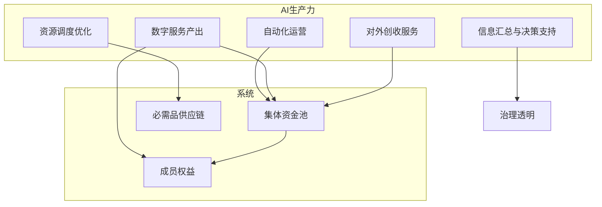
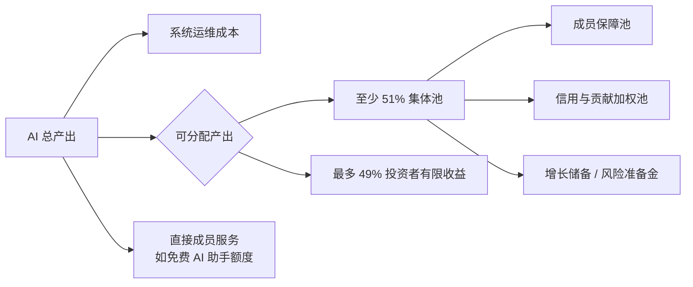
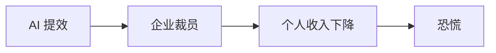
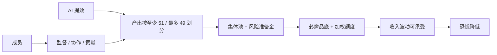

# AI 养人

> 哲学依据见 [哲学基础](../philosophy/foundations.md#9-ai-养人的哲学)。  
> 机制位置见 [机制总览](./mechanism-overview.md#6-ai-养人机制摘要)。

## 1. 核心主张

> **AI 不应只替代人的劳动，也应成为集体养人的生产力。**

许多恐慌来自「被 AI 代替」。安心基座的思路是翻转叙事：

- AI 的产出归属**集体**，而非少数资本所有者
- 成员不必与 AI 竞争同一岗位，而是**共享 AI 带来的增量**
- 人负责方向、监督、协作；AI 负责规模化执行——**AI 干活，人享其成**

---

## 2. 「AI 养人」的含义

| 维度 | 说明 |
|------|------|
| 谁养谁 | 系统内的 AI 生产力 → 集体资金 / 直接服务 → 成员基本保障 |
| 与失业的关系 | 成员收入可波动，但集体底仍在；AI 补的是「系统级收入」，不是个人雇佣 |
| 与信义分的关系 | AI 产出进入系统总产出后，至少 51% 进入集体池；Tier 0 定期、接近均等发放，Tier 1+ 按贡献权益分加权 |
| 气质 | 宽松：不强制每人会用 AI，但全员受益于 AI 产出 |

---

## 3. AI 在系统中的角色

### 3.1 对内：降本增效

| 能力 | 作用 |
|------|------|
| 物资调度 | 预测需求、优化库存、减少损耗 |
| 财务透明 | 自动生成收支报告、异常检测 |
| 成员服务 | 智能问答、额度查询、申诉引导 |
| 信义分记录 | 贡献自动登记、规则一致执行 |

### 3.2 对外：造血

| 能力 | 作用 |
|------|------|
| 内容 / 知识服务 | 培训材料、社区百科、可售卖数字产品 |
| 自动化工具 | 为其他合作社提供 SaaS，收入回流池子 |
| 数据协作（合规） | 脱敏后的协作任务，换取服务或资金 |

### 3.3 对人：协作而非替代

成员可参与 AI 协作类贡献，例如：

- 标注、审核 AI 输出
- 提供本地知识（供应链、医疗、法律）
- 定义任务目标与伦理边界（human-in-the-loop）

---

## 4. 价值分配原则

1. **优先覆盖运维**：算力、API、人工监督
2. **可分配产出按至少 51 / 最多 49 划分**：集体池优先，投资者回报有上限、期限或递减机制
3. **Tier 0 定期领取、接近均等，Tier 1+ 按贡献加权**：Tier 0 托底，Tier 1+ 激励贡献与长期参与
4. **协作者加成**：参与 AI 训练、审核、任务定义者可获信义分加成

---

## 5. 与「被 AI 替代」焦虑的关系

传统路径：

安心基座路径：

关键差异：**AI 增值的主要分配单元是集体，不是单个雇主；投资者可以分享有限收益，但不能长期抽走公共增量。**

---

## 6. 边界与伦理

| 原则 | 说明 |
|------|------|
| 人类监督 | 涉及扣分、资金、医疗等决策，AI 仅建议，人工仲裁 |
| 透明 | AI 参与了哪些决策、产出多少价值，定期公开 |
| 隐私 | 成员数据不用于对外模型训练（除非明示同意） |
| 不夸大 | 不说「AI 完全养活人」，而是「AI 降低系统成本、增加池子增量」 |
| 防集中 | AI 基础设施可多方供应，避免单点控制 |

---

## 7. 未来验证时的 AI 能力（附录）

> 概念阶段仅作能力枚举；具体优先级待 [开放问题](../philosophy/tensions-and-open-questions.md) 闭合后再定。

试点不必大而全，建议 1–2 项：

| 优先级 | 能力 | 预期效果 |
|--------|------|----------|
| P0 | 物资与需求匹配助手 | 减少浪费，提升储备效率 |
| P0 | 透明账本与自然语言查询 | 增强信任，降低运营成本 |
| P1 | 成员贡献自动登记 | 信义分记录一致 |
| P2 | 对外轻量数字服务 | 小规模造血验证 |

---

## 8. 一句话总结

**AI 养人，不是 AI 替人扛全部生活，而是让 AI 为系统工作，把至少 51% 的增量、增长储备和风险准备转化为成员可预期的生活底。**
