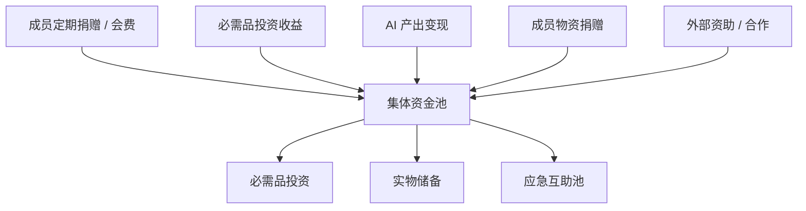
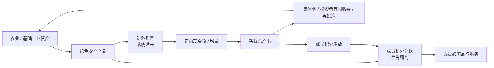
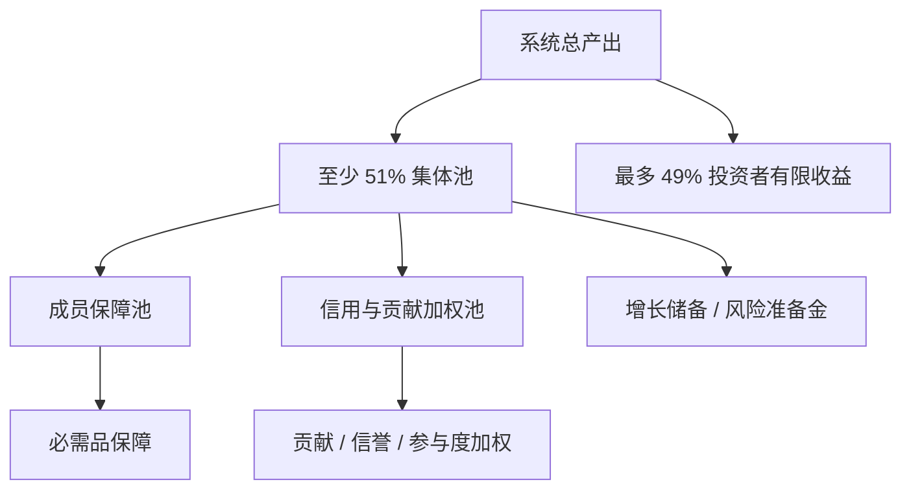

# 集体资金与必需品投资

> 哲学依据： [哲学基础](../philosophy/foundations.md#8-第三层安全网) · 机制位置： [机制总览](./mechanism-overview.md#5-集体资金机制摘要) · 分配结构： [所有权与分配机制](./ownership-and-distribution.md) · 经济约束： [经济模型与激励设计](./economic-model.md)

## 1. 资金池定位

集体资金池是安心基座的**物质底**，目标不是追求最高收益，而是：

- 保障或降低生活必需品的获取成本
- 提供与劳动市场脱钩的稳定预期
- 为 AI 产出与成员贡献提供价值沉淀载体

资金池遵循 **至少 51% 集体 / 最多 49% 投资者** 的结构。集体部分用于成员保障、信用与贡献加权分配、增长储备与风险准备金；投资者部分用于回报出资和风险承担，但应有期限、上限或递减机制。

资金投向以**农业 / 基础工业**为主。系统优先掌握生活底层供给能力，而不是追逐高收益金融资产。

农业 / 基础工业项目必须满足**绿色安全**要求：生产流程、关键技术、检验检疫、质量追溯、环境影响原则上公开透明。

---

## 2. 资金来源

| 来源 | 说明 |
|------|------|
| 成员会费 | 自愿或约定额度，可分层 |
| 投资收益 | 必需品相关资产的股息、租金、分红 |
| 对外销售 | 农业 / 基础工业产品向集体外销售，为系统引入增长增量 |
| AI 产出 | 数字服务、自动化运营节省、对外服务等 |
| 物资捐赠 | 直接充实实物储备 |
| 外部合作 | 企业 CSR、政府补贴、基金会（合规前提下） |

---

## 3. 投资标的

标的需满足：**刚需、可长期持有、收益或实物可分配、能增强底层供给能力**。

| 类型 | 示例 | 保障形式 |
|------|------|----------|
| 农业 | 农业合作社、种植基地、粮食加工、仓储冷链 | 粮食供应、成本价采购、分红 |
| 基础工业 | 能源、基础材料、农机、食品加工、公共设施 | 成本价供应、分红、生产能力 |
| 储备型 | 粮食、基础药品、清洁用水 | 按额度领取 |
| 服务型 | 社区诊所、托育、老年照料 | 补贴价或免费额度 |
| 金融型（辅助） | 高流动性低风险工具、必要的抗通胀资产 | 现金流管理、风险准备 |

### 3.1 投资原则

1. **农业 / 基础工业优先**：粮食、能源、基础材料、食品加工、基础制造优先进入白名单
2. **绿色安全**：原料、生产、加工、仓储、运输、检验检疫、质量追溯公开透明
3. **安全第一**：高风险投机不在白名单内
4. **刚需优先**：口粮、能源、医疗、基础住房、通信
5. **透明可审计**：投资清单、收益、流向、决策理由定期公开
6. **地域适配**：试点社区以本地供应链为主

### 3.2 推荐资产比例（混合基座型）

| 篮子 | 比例 | 作用 |
|------|------|------|
| 绿色安全农业 / 基础工业资产 | 70% | 长期供给能力、分红、抗通胀、对外销售现金流 |
| 实物储备 | 20% | 即时保障感、应急 |
| 应急互助池 | 10% | 失业、疾病等突发支取 |

---

## 4. 绿色安全与质量透明

农业 / 基础工业资产必须建立从生产到交付的公开透明机制：

| 环节 | 公开要求 |
|------|----------|
| 原料来源 | 种子、饲料、矿物、能源、基础材料来源可追溯 |
| 生产流程 | 种植、养殖、加工、制造流程公开；关键变更需记录 |
| 技术方案 | 使用的农业技术、加工工艺、环保技术、质量控制方案公开说明 |
| 检验检疫 | 批次检测、检疫报告、质量标准、异常批次处理结果公开 |
| 仓储物流 | 仓储条件、冷链记录、运输路径、损耗率公开 |
| 环境影响 | 用水、用能、排放、污染控制、生态影响定期披露 |

绿色安全不是营销标签，而是集体资产能否被信任的基础。若项目无法做到关键流程可追溯、检验检疫可查、异常处理可公开，不应进入核心投资白名单。

---

## 5. 成员积分兑换与外销增长

农业 / 基础工业产品通过两条渠道流出：**成员积分兑换**（优先履约）与**对外销售**（系统增长引擎）。二者不是「谁先切配额」的关系，而是 **兑换优先 + 增长平衡**。

### 5.1 不变量

1. **成员积分兑换优先履约**：成员用积分换取指定品类时，系统优先排产、优先发货 / 提供服务，不因外销价更高而挤占成员兑换。
2. **外销服务于整体增长**：对外销售的目的不是背离集体保障，而是为系统引入增量——现金、品牌、规模与再投资能力。若只有向内消耗、没有外销带来的增长，池子会被兑空，结构不可持续。

### 5.2 积分与兑换

成员获得的保障与贡献权益，以 **积分**（或等价的额度券 / 代金券）形式用于兑换集体产品与服务：

| 要素 | 说明 |
|------|------|
| 积分来源 | Tier 0 由成员保障池**按周期定期**、接近均等发放；Tier 1+ 由信用与贡献加权池按贡献权益分发放 |
| 兑换对象 | 指定品类（米、油、药、托育次数等）与成本价供应 |
| 兑换价格 | 低于外销市场价，体现成员优待 |
| 履约顺序 | 有效积分兑换请求优先于外销订单 |

积分兑换不是免费均分，而是 **用已分配权益换取实物**；贡献多、信用稳的成员，积分额度更高。

### 5.3 外销与增长平衡

对外销售原则：

1. **增长导向**：外销收益进入系统总产出，用于再投资、风险准备金、积分发放与投资者有限回报——形成「产出 → 外销增量 → 池子增厚 → 更多保障与兑换能力」的闭环。
2. **不能只消耗没增长**：须监控 **外销增量 + 再投资 + AI 造血** 是否覆盖 **成员积分兑换消耗 + 运维成本**。若长期净消耗，应触发预警并调整兑换品类、积分发放或外销策略。
3. **价格透明**：成员积分兑换价、外部销售价、毛利和流向定期公开。
4. **品牌信用来自透明**：绿色安全、全流程公开、检验检疫公开是对外销售的核心竞争力。

### 5.4 可操作比例（概念阶段建议值，落地可调）

| 指标 | 建议方向 | 作用 |
|------|----------|------|
| 外销占可售产出 | ≥ 30%（试点可调） | 保证系统有外向增量，避免纯内耗 |
| 成员积分兑换占可售产出 | ≤ 70%（与上项联动） | 留足外销空间以维持增长 |
| 外销增量 / 积分兑换消耗 | ≥ 1.0（滚动周期） | 净增长平衡：兑出去的值须被增量托住 |
| 成员兑换履约 SLA | 优先于外销排产 | 落实「积分换取、优先提供」 |
| 积分兑换价 / 外销价 | 成员价显著低于外销价 | 成员优待可感知，外销保留毛利空间 |

上述比例为治理可调参数，须公开披露；偏离时须说明理由并限期修正。

---

## 6. 保障形式

成员获得的不是抽象「施舍」，而是**集体资产带来的权益**，并主要通过 **积分** 落地兑换：

| 形式 | 说明 |
|------|------|
| 积分 | Tier 0 定期领取、接近均等；Tier 1+ 按贡献加权；均用于兑换，兑换时优先履约 |
| 代金券 / 额度券 | 积分的具体载体，指定品类（米、油、药） |
| 成本价供应 | 积分兑换价接近成本，低于外销市场价 |
| 现金分红 | Tier 1+ 或池外必需支出；Tier 0 以积分兑换直供型必需品为主 |
| 服务额度 | 社区医疗、托育、法律咨询次数，可按次扣积分或直接发放额度 |

---

## 7. 收益分配

### 7.1 总产出划分

| 部分 | 比例 | 作用 |
|------|------|------|
| 集体池 | 至少 51% | 保障原则、成员权益、增长储备、风险准备金 |
| 投资者收益 | 最多 49% | 回报出资、资源、基础设施与早期风险，但有限 |

51% 不只是收益比例，也代表集体控制权。投资者可以获得收益，但不能控制保障原则、信义分规则和必需品优先方向。投资者收益应设回报封顶、期限限制或递减分成。

### 7.2 集体池内部拆分

| 类别 | 建议比例 | 对应层级 | 作用 |
|------|----------|----------|------|
| 成员保障池 | 30% | **Tier 0** | 成员定期领取、接近均等的 Tier 0 积分 |
| 信用与贡献加权池 | 50% | **Tier 1+** | 贡献权益分加成的增量积分 |
| 增长储备 / 风险准备池 | 20% | — | 补充资产、抗周期、扩大保障能力 |

### 7.3 分配优先级

1. 运维与 AI 成本（保证系统运转）
2. 风险准备金最低水位
3. 投资者有限回报
4. Tier 0 成员保障池（接近均等的 Tier 0 积分）
5. Tier 1+ 信用与贡献加权池
6. 剩余再投资

**Tier 0** 向合格成员**定期**、接近均等发放积分；成员信用分仅做风控，不拉开 Tier 0 差距。**Tier 1+** 才按贡献权益分加权。详见 [保障分层](../design/ownership-and-distribution.md#4-保障分层tier-0--tier-1)。

### 7.4 经济风控

| 风险 | 机制 |
|------|------|
| 逆向选择 | 新成员观察期；完整权益逐步释放 |
| 道德风险 | 最低保障低而稳，更高额度来自贡献 |
| 大额支取 | 限额、复核、共付比例 |
| 池子被短期分光 | 风险准备金前置，未达最低水位前减少分配 |

---

## 8. 可持续性估算（示例）

| 参数 | 数值 |
|------|------|
| 成员数 | 1,000 |
| 人均会员费 | 100 元 |
| 年入池 | 120 万 |
| 稳定资产占比 | 30%（试点保守） |
| 假设年化 | 5% |
| 年投资收益 | ~1.8 万 |

试点期需保守承诺；规模扩大 + AI 造血后，人均保障额度可提升。

---

## 9. 合规要点

- 注册为**合作社、互助协会、公益基金会**等合法主体（视地区而定）
- 专户管理，投资白名单，定期第三方审计
- 不向公众吸收存款，不承诺固定高回报（避免非法集资风险）

---

## 10. 信息公开

资金相关信息原则上全部公开透明：

| 信息 | 公开要求 |
|------|----------|
| 资金流入 | 来源类别、金额、时间 |
| 资金流出 | 用途、金额、审批记录 |
| 投资标的 | 名称、类型、金额、预期作用、风险说明 |
| 绿色安全 | 全流程、关键技术、检验检疫、质量追溯、环境影响 |
| 对外销售 | 产品批次、销售对象类别、价格区间、收入、毛利、收益流向 |
| 收益分配 | 集体池、投资者有限收益、增长储备、成员权益的比例和金额 |
| 风险准备金 | 当前余额、最低水位、变动原因 |
| 审计与异常 | 审计报告、异常交易、纠正结果 |

个人隐私可脱敏，但不得隐藏资金流向、决策依据和系统性风险。
