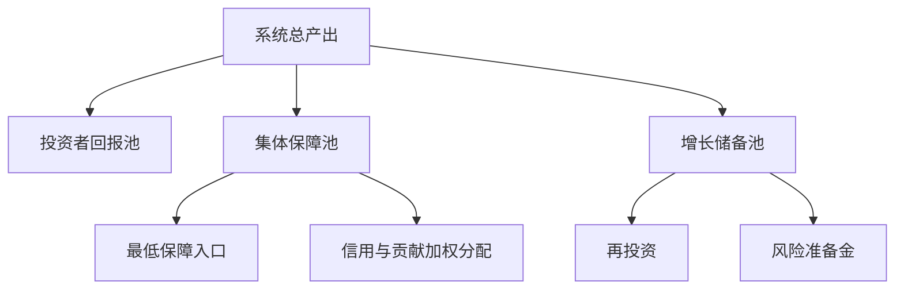
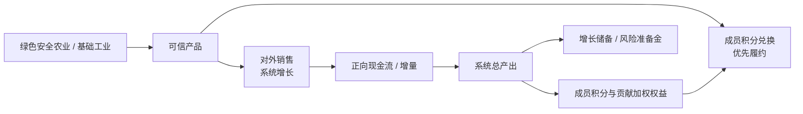
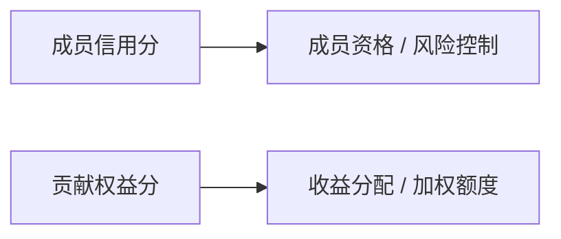

# 经济模型与激励设计

> 本文档从经济学角度约束安心基座：它不是单纯福利系统，而是 **合作社 + 互助保险 + AI 生产力基金** 的混合体。

## 1. 核心经济原则

一句话：

> **底线不厚，贡献有价，资本有利但有限，集体有最终控制权。**

| 原则 | 作用 |
|------|------|
| 底线不厚 | 降低恐慌，但不替代劳动和贡献 |
| 贡献有价 | 让成员愿意持续投入劳动、知识、治理和 AI 协作 |
| 资本有利但有限 | 吸引投资者，但防止长期抽水 |
| 集体最终控制 | 保障原则不被资本收益最大化吞掉 |
| 风险准备前置 | 先抗周期，再分配增量 |
| 底层供给优先 | 资金优先投向农业 / 基础工业，掌握必需品生产能力 |
| 绿色安全增信 | 全流程、技术、检验检疫公开透明，用信任换取长期市场 |

---

## 2. 三池结构

51 / 49 是所有权边界；经济运行上建议拆成三类池：

| 池子 | 经济功能 |
|------|----------|
| 投资者回报池 | 吸引资本、资源、基础设施和早期风险承担 |
| 集体保障池 | 支付成员保障与信用 / 贡献加权权益 |
| 增长储备池 | 再投资、风险准备、抗周期、扩大资产厚度 |

这三个池子可以映射到 51 / 49 结构：

- **投资者回报池**来自可分配收益中的投资者部分，但应有上限。
- **集体保障池 + 增长储备池**属于 51% 集体控制部分。

增长储备池优先投向农业与基础工业，而不是高波动金融资产。经济目标不是最大化账面收益，而是提高粮食、能源、基础材料、基础制造等底层供给能力。

农业 / 基础工业资产应采用绿色安全标准，并通过全流程、关键技术、检验检疫、质量追溯公开透明来形成市场信任。产品两条出路：**成员用积分兑换（优先履约）** 与 **对外销售（系统增长引擎）**。外销引入的增量须托住向内兑换的消耗，不能只消耗没增长。

---

## 3. Tier 0 与 Tier 1+ 的分工

集体保障池内部分为两层（详见 [所有权与分配机制](./ownership-and-distribution.md#4-保障分层tier-0--tier-1)）：

| 层级 | 经济功能 | 分配规则 |
|------|----------|----------|
| Tier 0 | 降低「会不会塌」的恐慌 | 成员定期领取接近均等的 Tier 0 积分 |
| Tier 1+ | 激励持续贡献 | 贡献权益分加权，设上限 |

三池结构中，**集体保障池**同时承载 Tier 0 与 Tier 1+；运维上可拆为「成员保障池 + 信用与贡献加权池」两个子池，分别对应两层。

---

## 4. 投资者回报：有利但有限

49% 不建议设计成永久、无限、无条件的收益权。否则长期看会变成资本抽水，削弱集体池。

更稳的方式：

> **投资者最多参与 49% 可分配收益，且应设期限、回报上限或递减机制。**

可选机制：

| 机制 | 含义 |
|------|------|
| 回报封顶 | 达到约定倍数后，投资者分成下降 |
| 期限限制 | 早期投资享受较高分成，期限后转低比例 |
| 递减分成 | 系统越稳定，投资者比例越低 |
| 优先但有限 | 投资者可优先回收本金和合理收益，但不能永久占用公共增量 |

建议表达：

> 初始阶段，系统可分配收益中最多 49% 用于投资者回报；当投资者达到约定回报上限后，超额收益应更多回流集体池。

---

## 5. 双分制：信用分与贡献分分离

原来的「信义分」容易承担太多功能。经济学上建议拆成两类：

| 分数 | 回答的问题 | 用途 |
|------|------------|------|
| 成员信用分 | 这个人是否可信、是否破坏系统？ | 成员资格、Tier 0 风控、申诉、惩罚 |
| 贡献权益分 | 这个人为系统创造了多少可验证价值？ | **Tier 1+** 分配、加成、治理权重 |

这样可以避免一个分数同时决定「能不能留下」和「能分多少」，降低道德化和阶级化风险。

---

## 6. 逆向选择风险

如果保障太好，系统最容易吸引高风险、低贡献者；低风险、高贡献者可能觉得不划算而退出。

应对机制：

| 风险 | 机制 |
|------|------|
| 新成员只为领取保障而加入 | 观察期 / 等待期 |
| 高风险成员集中进入 | 应急额度与历史贡献、连续参与时间挂钩 |
| 低风险高贡献者退出 | 贡献权益分必须带来明显加成 |
| 大额支取冲击池子 | 大额保障需复核、限额、共付比例 |

建议：

> 新成员可以先获得成员身份和低额度入口，但完整权益应逐步释放。

---

## 7. 道德风险

保障存在后，部分成员可能减少贡献或过度使用资源。

应对机制：

1. **Tier 0 低而稳且接近均等**：解决恐慌，不替代劳动收入。
2. **更高额度来自 Tier 1+**：贡献越多，增量积分越多。
3. **高成本项目设共付比例**：医疗、住房、长期照护不能无限报销。
4. **长期零贡献 Tier 1+ 权重下降**：不直接踢出，Tier 0 仍可保留。
5. **异常使用复核**：防止恶意占用资源。

---

## 8. 风险准备金优先

不能赚多少分多少。系统必须先留出抗周期能力。

建议分配顺序：

1. 运维成本与 AI 成本
2. 风险准备金最低水位
3. 投资者有限回报
4. Tier 0 生存底线（成员保障池）
5. Tier 1+ 贡献权益加权分配
6. 再投资

其中 2 是关键：如果没有风险准备金，系统在第一次危机时就会失去信任。

---

## 9. 可持续性指标

概念阶段不设具体数字，但经济模型至少要观察这些指标：

| 指标 | 说明 |
|------|------|
| 贡献覆盖率 | 有持续贡献的成员占比 |
| Tier 0 覆盖率 | 享有 Tier 0 积分的合格成员占比 |
| Tier 0 / Tier 1+ 支出比 | Tier 0 是否被增量激励挤压 |
| 风险准备倍数 | 风险准备金可覆盖几个月支出 |
| 投资者抽水率 | 投资者收益 / 系统总产出 |
| AI 产出成本比 | AI 创造或节省的价值 / AI 成本 |
| 高贡献成员留存率 | 检验激励是否足够 |
| 对外销售毛利率 | 绿色安全产品对外销售是否形成正向收益 |
| 质量透明度 | 检验检疫、批次追溯、异常处理是否完整公开 |

---

## 10. 经济模型一句话

**安心基座不是把收益平均分掉，而是用有限资本回报撬动绿色安全的农业 / 基础工业资产，用外销形成系统增长增量、用积分兑换优先履约服务成员，用 Tier 0 接近均等托底、Tier 1+ 按贡献分配增量，用风险准备金保护长期信任。**
