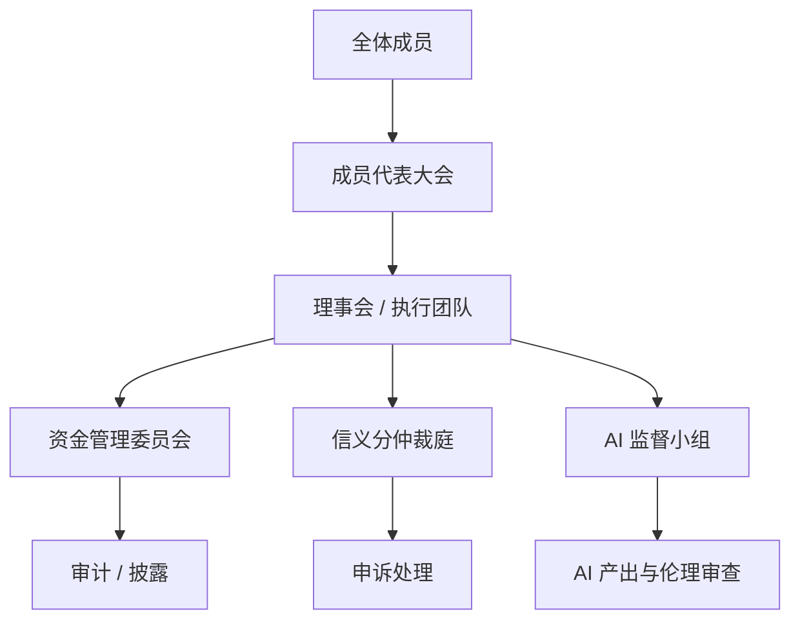
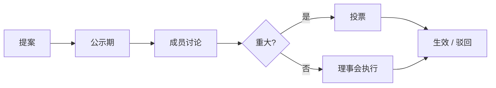

# 治理与风险

## 1. 治理结构（建议）

| 机构 | 职责 |
|------|------|
| 成员代表大会 | 规则修订、预算批准、理事选举、维护至少 51% 集体控制权 |
| 理事会 | 日常执行、对外合作 |
| 资金管理委员会 | 投资白名单、专户、披露、投资者条款审查、农业 / 基础工业优先审查、对外销售收益审查 |
| 信义分仲裁庭 | 事后争议、扣分、赔偿、申诉（轮换制） |
| AI 监督小组 | AI 产出审计、隐私与伦理边界 |
| 质量与安全公开小组 | 绿色安全、全流程透明、检验检疫、质量追溯、环境影响披露 |

原则：**轮换、透明、可申诉、事后追责**，防止少数人长期把持「善恶定义权」。

---

## 2. 决策流程

**重大事项**（需投票）：章程修改、投资白名单变更、成员信用分 / 贡献权益分规则大改、年度预算、风险准备金水位调整、任何可能影响 51% 集体控制权的投资者条款、偏离农业 / 基础工业优先原则的重大投资、可能影响绿色安全标准、成员积分兑换或外销增长平衡的对外销售策略。

---

## 3. 主要风险与应对

| 风险 | 描述 | 应对 |
|------|------|------|
| 信义分权力化 | 成为排斥异己工具 | 公开规则、申诉、轮换仲裁 |
| 资金挪用 | 池子被少数人控制 | 专户、白名单、第三方审计 |
| 黑箱治理 | 账本、投资、分配和惩罚不透明 | 规则、账本、资金流向、投资标的、分配结果原则上公开 |
| 投资偏离底层供给 | 资金追逐高收益资产，偏离农业 / 基础工业 | 投资白名单、重大偏离需成员投票 |
| 绿色安全失信 | 农业 / 基础工业产品无法追溯、检验检疫不透明 | 全流程公开、批次追溯、第三方检测、异常批次公开处理 |
| 外销挤占成员兑换 / 纯内耗无增长 | 为外销利润牺牲积分兑换履约，或只有兑换消耗无外销增量 | 积分兑换优先排产；监控外销增量 ≥ 兑换消耗；外销占比与定价公开 |
| 投资者架空 | 49% 投资者通过债权、优先清算、董事席位等实际控制系统 | 章程锁定至少 51% 集体控制权，重大条款成员投票 |
| 资本抽水 | 投资者长期无上限分成，削弱集体池 | 回报封顶、期限限制、递减分成 |
| 逆向选择 | 高风险低贡献者集中加入，低风险高贡献者退出 | 观察期、等待期、完整权益逐步释放 |
| 道德风险 | 有保障后减少贡献或过度使用资源 | 最低保障低而稳，高成本项目限额 / 共付 / 复核 |
| 搭便车 | 只领取不贡献 | 保留最低入口，但集体池按贡献权益分加权；贡献多额度高 |
| 法律合规 | 被认定为非法集资等 | 合法主体、不承诺高固定回报、律师审查 |
| 规模不经济 | 小池子难以覆盖保障 | 社区试点 → 区域联盟 |
| AI 依赖 | 单点故障或/vendor lock-in | 多供应商、人类 fallback、产出透明 |
| AI 伦理 | 自动决策伤害成员 | human-in-the-loop、敏感域禁止全自动 |
| 道德泛化 | 「不作恶」被扩大解释 | 成文底线清单 + 事后损害原则 + 比例原则 |

---

## 4. 合规清单（落地前）

- [ ] 确定法律主体形式（合作社 / 协会 / 基金会）
- [ ] 资金专户与财务制度
- [ ] 投资白名单与风控上限
- [ ] 农业 / 基础工业优先的投资审查规则
- [ ] 绿色安全标准、检验检疫标准与质量追溯制度
- [ ] 成员积分兑换规则、履约优先级与外销增长平衡指标
- [ ] 对外销售定价、占比、收益回流披露规则
- [ ] 投资者回报封顶 / 期限 / 递减机制
- [ ] 风险准备金最低水位
- [ ] 信息公开目录与披露频率
- [ ] 隐私政策与数据处理规范
- [ ] AI 使用范围与监督机制
- [ ] 成员退出与资产处理规则
- [ ] 定期披露模板（季度）

---

## 5. 与外部关系

| 关系方 | 定位 |
|--------|------|
| 国家社保 | 互补，不替代 |
| 商业保险 | 可选叠加 |
| 雇主 / 市场 | 劳动收入仍是主来源 |
| 其他社区 / 合作社 | 可联盟共享采购与 AI 能力 |
| 政府 | 合规登记，争取试点政策支持（若适用） |

---

## 6. 开放问题

治理相关未决问题已汇总至 [张力与开放问题](../philosophy/tensions-and-open-questions.md)。

概念阶段重点：

1. 规则成文与申诉机制是否足够（防信义分权力化）
2. AI 监督权是否轮换、是否可审计
3. 集体决策与少数 dissent 如何处理
4. 所有系统信息如何公开，哪些个人信息需要脱敏
5. 绿色安全与检验检疫信息如何公开到可验证程度
6. 积分兑换如何优先履约，外销如何托住增长而不变成纯内耗
7. 信用分惩罚如何保持事后追责，避免事前审查和道德泛化
8. 51% 集体控制权如何不被投资条款绕开
9. 投资者有限回报如何写入章程
10. 观察期、等待期、共付比例等经济风控如何设置

落地类问题（法律主体、冷启动、链上账本等） deliberately 暂不闭合。

---

## 7. 信息公开原则

系统信息默认公开透明，尤其是：

- 章程、规则、信义分加减分标准
- 资金流入、流出、余额、风险准备金
- 投资标的、投资理由、收益、风险
- 农业 / 基础工业资产的经营情况
- 农业 / 基础工业产品的原料来源、生产流程、关键技术、检验检疫、质量追溯、异常批次处理
- 产品对外销售与成员积分兑换的价格区间、占比、履约情况、销售规模、毛利、收益回流路径
- 集体池与投资者有限收益的分配结果
- 信用惩罚案例、申诉过程、最终裁决（个人隐私脱敏）

个人身份、健康、家庭等敏感信息可脱敏；但脱敏不能成为隐藏资金、权力和风险信息的理由。
