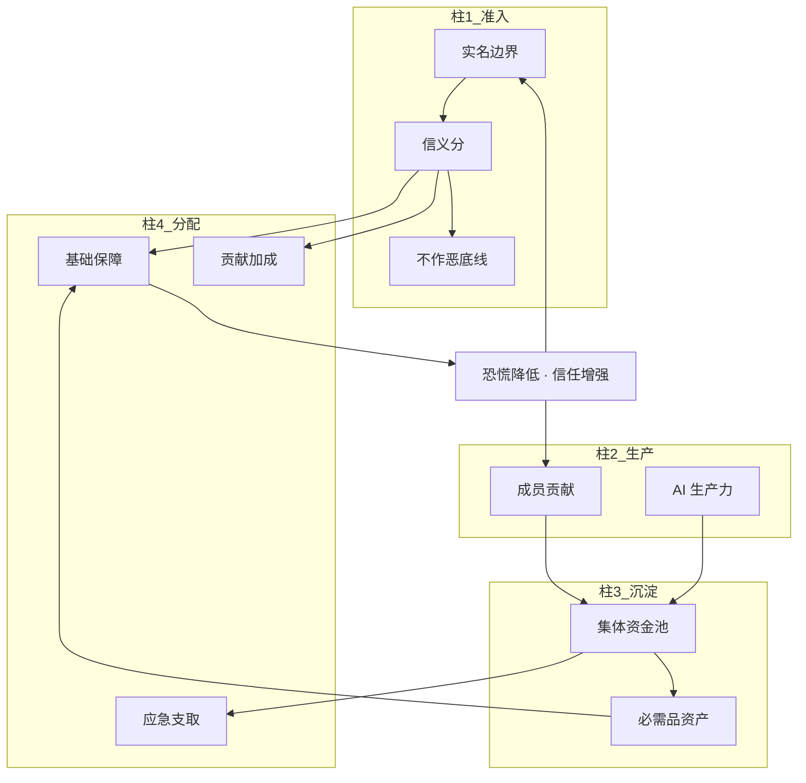
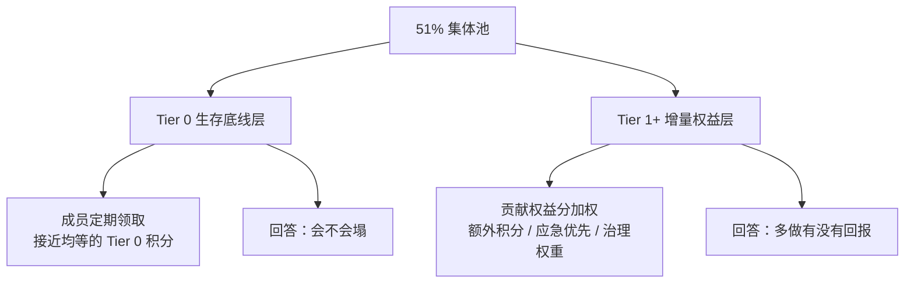
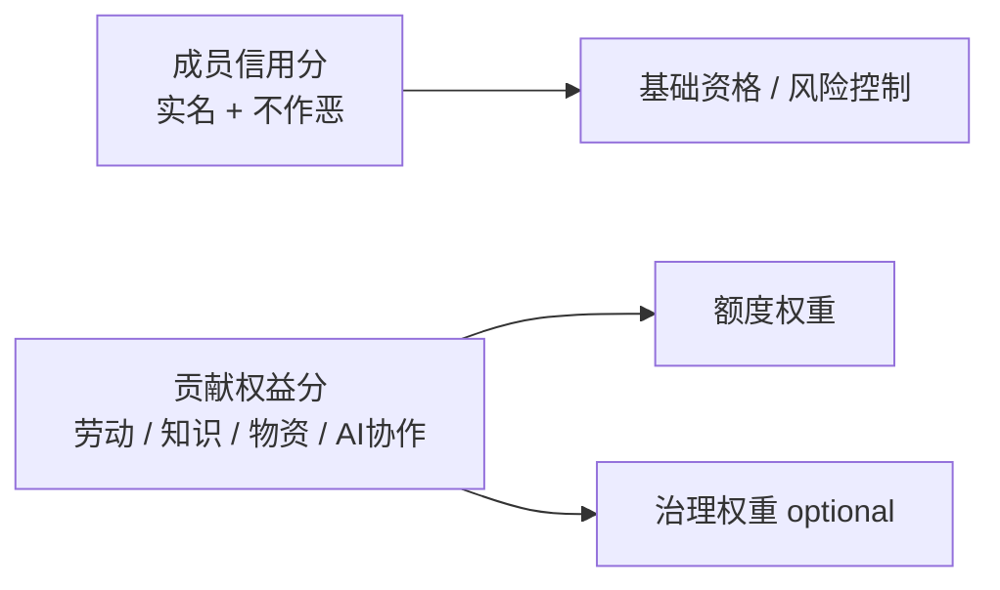
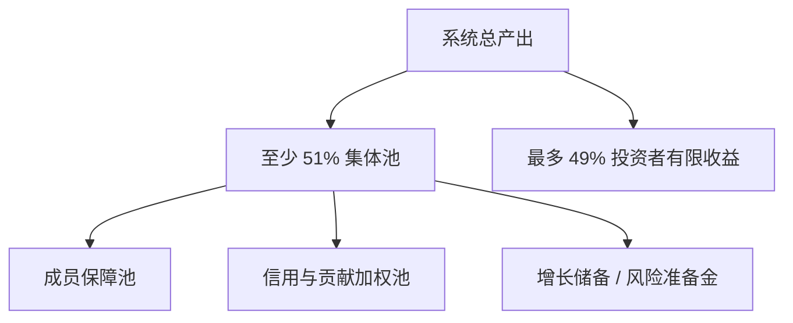
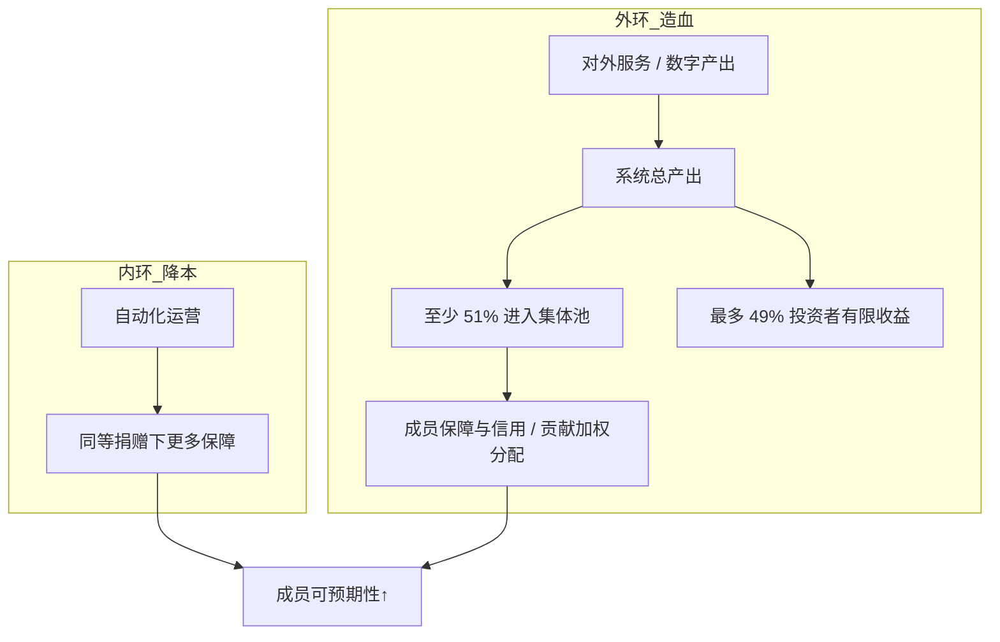
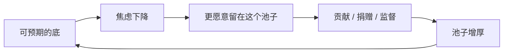
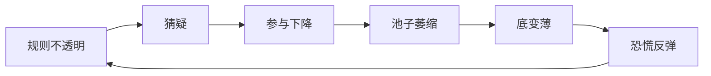
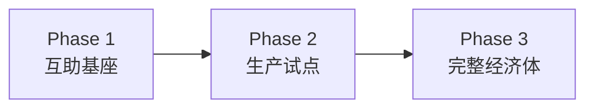

# 机制总览

> 本文档描述安心基座的**机制逻辑**——系统如何运转、各部件如何耦合。  
> 阶段：**开放概念**；数值、比例、法条均为**示意**，非最终方案。

## 1. 机制定义

**机制** = 在哲学约束下，让「托底」可重复发生的一整套规则与反馈环。

哲学（见 [哲学基础](../philosophy/foundations.md)）回答「为什么」；  
机制回答「靠什么运转、如何自我维持」。

---

## 2. 四大机制柱

| 柱 | 功能 | 核心机制 |
|----|------|---------|
| **准入** | 谁在这个池子里 | 实名 + 信义分 + 不作恶 |
| **生产** | 池子如何增长 | 人贡献 + AI 造血 |
| **沉淀** | 价值如何锚定 | 必需品投资 / 储备 |
| **分配** | 成员得到什么 | 基础档 + 加成 + 应急 |

---

## 3. 机制不变量

无论未来如何落地，下列不变量应成立：

| # | 不变量 | 违反则系统变质为 |
|---|--------|-----------------|
| I1 | 不作恶者必有基础资格 | 道德配给 / 施舍体系 |
| I2 | 惩罚事后、基于证据、可申诉 | 专制评分体系 |
| I3 | 池子投向农业 / 基础工业为主 | 普通投资基金 |
| I4 | AI 增量优先归集体 | 又一个 AI 裁员叙事 |
| I5 | 账本、规则、投资、分配、惩罚案例原则上公开透明 | 黑箱互助会 |
| I6 | 可自由退出（规则明示） | 封闭 cult / 传销结构 |
| I7 | 集体拥有至少 51% 控制与收益池 | 资本主导的普通商业项目 |
| I8 | 投资者回报有上限、期限或递减机制 | 长期资本抽水结构 |
| I9 | 农业 / 基础工业必须绿色安全、全流程透明 | 低信任的普通商品生意 |
| I10 | 成员用积分换取时优先履约；外销服务于系统增长，不能只向内消耗而无增量 | 纯消耗型内循环 / 为外销牺牲成员兑换 |
| I11 | Tier 0 成员定期领取接近均等的积分；Tier 1+ 增量才按贡献权益分加权 | 名义有底、实际极薄 / 或 Tier 0 也分级 |

I10 的可操作比例（外销占比、兑换占比、增长平衡指标等）见 [集体资金与必需品投资](./collective-fund.md#54-可操作比例概念阶段建议值落地可调)。

### 3.1 保障分层（Tier 0 / Tier 1+）

「宽松托底」与「贡献有价」容易混在一处，导致名义有底、实际极薄。因此集体池内的**成员-facing 分配**拆成两层：

| 层级 | 回答的问题 | 资格 | 分配规则 |
|------|-----------|------|----------|
| **Tier 0** | 基本生活会不会塌？ | 实名 + 不作恶 + 通过观察期 | 成员**定期领取**接近均等的 Tier 0 积分；用积分兑换必需品；成员信用分只做风控（暂停/恢复），不拉开 Tier 0 差距 |
| **Tier 1+** | 多做有没有回报？ | 在 Tier 0 之上 | **贡献权益分加权**的额外积分、应急优先、治理权重等（可与 Tier 0 同周期或按事件发放） |

**Tier 0 可操作约束**（概念阶段建议值，落地可调）：

| 指标 | 建议方向 | 作用 |
|------|----------|------|
| Tier 0 发放周期 | 每月 1 次（试点可调） | 形成可预期的领取节律，降低「会不会塌」的焦虑 |
| Tier 0 成员间额度比 | 最高 / 最低 ≤ 1.5 | 保证「接近均等」，避免 Tier 0 隐性分级 |
| Tier 0 占成员-facing 分配 | ≥ 40% | 心理底优先于增量激励 |
| 失去 Tier 0 的条件 | 仅事后认定的作恶 / 欺诈 / 损害集体且未恢复 | 不作恶者不被 Tier 0 排除 |

Tier 1+ 加权须有上限、可申诉、可恢复，详见 [所有权与分配机制](./ownership-and-distribution.md#4-保障分层tier-0--tier-1)。

---

## 4. 信义分机制（摘要）

完整版见 [信义分机制](./moral-score.md)。

### 4.1 双轨增长

- **成员信用分**：保证不作恶者不会被系统排除，并在事后处理欺诈、滥用、损害集体利益等行为
- **贡献权益分**：保证「多做不白做」，用于集体池加权分配

### 4.2 设计约束

- 基础轨增速应足以维持成员资格和最低关系入口（否则变成隐性驱逐）
- 贡献轨加成应有 **上限**（否则变成新阶级——见 [开放问题](../philosophy/tensions-and-open-questions.md#22-信义分-vs-平等尊严)）
- 扣分不得随意扩大「不作恶」的定义，必须聚焦已经发生的事实损害或有明确证据的集体利益损害风险

---

## 5. 集体资金机制（摘要）

完整版见 [集体资金与必需品投资](./collective-fund.md)。

所有权与分配结构见 [所有权与分配机制](./ownership-and-distribution.md)。默认原则：

> **至少 51% 属于集体，最多 49% 属于投资者；投资者回报有利但有限，Tier 0 接近均等托底，Tier 1+ 按贡献加权，并保留增长储备 / 风险准备金。**

### 5.1 价值锚定逻辑

池子不追求最大 IRR，而追求 **「农业 / 基础工业支撑下的必需品获取能力稳定」**：

| 锚定方式 | 机制作用 |
|---------|---------|
| 持有绿色安全农业资产 | 粮食、加工、仓储、冷链 → 口粮与抗通胀能力 |
| 持有绿色安全基础工业资产 | 能源、材料、基础制造 → 底层供给能力 |
| 对外销售可信产品 | 绿色安全 + 全流程透明 → 系统增长增量，托住积分兑换消耗 |
| 成员积分兑换 | 保障与贡献权益落地 → 优先履约，成本价低于外销 |
| 持有实物储备 | 断链时仍可领取 |
| 持有服务型资产 | 降低医疗 / 托育现金支出 |
| AI 注入 | 降低运营成本 + 外部收入 |

### 5.2 总产出划分

51% 不只是收益比例，也代表集体对系统方向的控制权。投资者最多参与 49% 的可分配收益，但应有回报封顶、期限限制或递减机制，不能支配信义分、保障原则和必需品优先方向。

### 5.3 集体池内部顺序

1. 系统运维（含 AI 成本）—— 否则系统停转  
2. 风险准备金最低水位 —— 否则无法抗周期  
3. 投资者有限回报 —— 吸引资本但防止长期抽水  
4. **Tier 0 生存底线** — 成员定期领取接近均等的 Tier 0 积分  
5. **Tier 1+ 贡献加权** — 按贡献、信誉、参与度分配增量  
6. 再投资 —— 长期可持续  

此顺序不可随意颠倒；若投资者收益或 Tier 1+ 加成长期挤压 Tier 0，系统气质即变。

---

## 6. AI 养人机制（摘要）

完整版见 [AI 养人](./ai-productivity.md)。

### 6.1 双环结构

- **内环**：同样 100 元捐赠，AI 让 admin 成本更低 → 更多进必需品  
- **外环**：AI 对外创造 revenue → 即使捐赠不变，底也可加厚  

### 6.2 人机分工原则

| 角色 | 负责 |
|------|------|
| AI | 规模化、重复性、预测、生成 |
| 人 | 目标、伦理边界、仲裁、本地知识、最终签字 |
| 集体 | 拥有 AI 产出与分配规则 |

敏感域（信义分扣分、资金划拨、医疗资格）**禁止 AI 全自动**。

---

## 7. 治理机制（摘要）

完整版见 [治理与风险](./governance-and-risks.md)。

概念阶段的治理原则：

1. **规则成文** — 不成文则信义分必腐化  
2. **权力轮换** — 仲裁、审计、AI 监督不可终身  
3. **异议通道** — 少数 dissent 有登记与复核，不是沉默  
4. **披露节律** — 池子状态、AI 产出、争议案例定期公开  

组织形态（合作社 / DAO / 协会）**刻意未定**。

---

## 8. 反馈环

### 8.1 正向环（系统希望加强）

### 8.2 负向环（系统必须抑制）

机制设计的目标：**让正向环默认占优**，并在负向环早期设熔断（审计、申诉、临时冻结权力）。

---

## 9. 三种资产组合（机制选项，非定论）

| 模式 | 机制特征 | 适用想象 |
|------|---------|---------|
| **分红型** | 偏金融锚定，轻运营 | 城市、高流动性社区 |
| **储备型** | 偏实物锚定，重信任 | 农村、供应链短社区 |
| **混合型** | 平衡抗通胀与即时感 | 多数情形的默认讨论起点 |

概念阶段 **推荐以混合型为默认讨论模板**，但不排斥其他模式在特定语境下更优。

---

## 10. 三期路线图

目标堆叠过多时，冷启动要求极高。机制**不必同时全部启动**，按阶段递进：

| 阶段 | 核心目标 | 刻意不做 |
|------|----------|----------|
| **Phase 1 互助基座** | 互助 + 实物储备 + 透明账本 + **Tier 0** 生存底线 | 不投重资产、不引大资本、不启动 51/49 复杂结构 |
| **Phase 2 生产试点** | 一个绿色农业 / 基础工业资产 + 外销试点 + 成员积分兑换 | 不全国扩张、不多资产组合 |
| **Phase 3 完整经济体** | 51/49、AI 造血、多资产组合、**Tier 1+** 完整激励 | 不在 Phase 1 一次性启动 |

各阶段与机制模块的对应关系：

| 模块 | Phase 1 | Phase 2 | Phase 3 |
|------|---------|---------|---------|
| Tier 0 接近均等底线 | ✓ | ✓ | ✓ |
| 透明账本 / 规则成文 | ✓ | ✓ | ✓ |
| 贡献权益分 / Tier 1+ | 轻量 | 扩展 | 完整 |
| 农业 / 基础工业资产 | — | 单资产试点 | 多资产组合 |
| 外销增长闭环 | — | 试点 | 完整 |
| 51/49 + 投资者有限回报 | — | 可选引入 | ✓ |
| AI 造血（外环） | 降本 / 账本为主 | 扩展 | 完整 |

[MVP 试点方案](./mvp.md) 可视为 **Phase 1 草案**，待 Tier 0 与透明治理共识后再启用。

---

## 11. 与实现层的边界

| 属于机制层（现在打磨） | 属于实现层（暂不碰） |
|----------------------|---------------------|
| 四柱结构与不变量 | 具体 App / 智能合约 |
| 成员信用分 / 贡献权益分逻辑 | 具体加分公式 |
| 分配优先级 | 具体 SKU 与金额 |
| AI 人机分工原则 | 具体模型与 API |
| 治理原则 | 注册哪类法律主体 |
| 开放张力清单 | MVP 时间表 |

[MVP 试点方案](./mvp.md) 仅作**未来可能路径的附录**，不代表当前工作重心。

---

## 12. 机制一句话

**实名划界，信用控险，Tier 0 定期领积分托底，贡献定权于 Tier 1+，集体控股，资本有限利，分阶段递进，人智与 AI 造血，必需品锚池，透明闭环消恐慌。**
