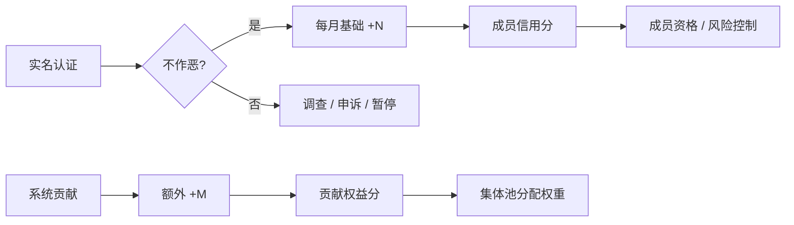
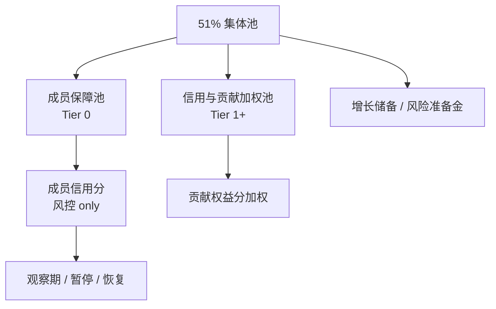
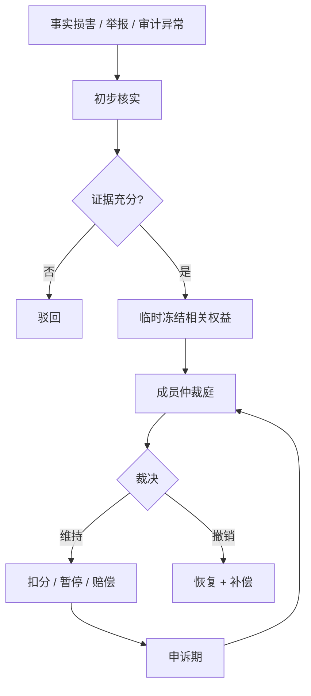

# 信义分机制

> 原称「道德分」。对外建议使用 **信义分**，强调信任与参与，避免道德审判感。  
> 哲学依据见 [哲学基础](../philosophy/foundations.md#5-为什么叫信义分而不是道德分)。  
> 机制位置见 [机制总览](./mechanism-overview.md#4-信义分机制摘要)。

## 1. 定位

信义分是系统中的**信任与贡献权重**。对外可以统称「信义分」，但内部建议拆成两类：

| 分数 | 决定什么 |
|------|----------|
| 成员信用分 | 是否维持成员关系、基础资格、事后风控状态 |
| 贡献权益分 | 集体池中成员保障额度、贡献加成、治理投票权重（若采用） |

信义分**不是**传统征信，不用于商业贷款；**不是**意识形态评分；也不是对人格价值的判断。它主要用于集体池内部的事后风控和加权分配。

---

## 2. 分数来源

| 来源 | 影响分数 | 规则 | 说明 |
|------|----------|------|------|
| 基础增长 | 成员信用分 | 实名 + 不作恶 → 每月 +N | 宽松存续，无需高贡献 |
| 贡献增长 | 贡献权益分 | 会员费 / 劳动 / 知识 / 物资 / 治理 → +M | 激励共建；会员费计入 Tier 1+ |
| 衰减（可选） | 贡献权益分 | 长期零参与 → 缓慢 -k | 防止僵尸账户占资源 |

---

## 3. 「不作恶」与事后风控

信用分的风控 / 惩罚以**事后追责**为主，不做大规模事前审查。系统默认成员可参与，只有在出现事实损害或明确风险行为后，才进入调查、扣分、暂停权益或赔偿流程。

判断核心：

> **是否违反基本道德底线，是否损害集体利益。**

**宽松版**——只设底线，不设高线：

1. 不欺诈系统、不恶意占资源
2. 不伤害其他成员基本权益
3. 不做明显违法、蓄意损人行为
4. 不故意损害集体资产、集体信誉、共同供应链和公共规则

**明确不做**：

- 意识形态审查
- 生活方式评判（消费、婚恋、信仰等）
- 用信义分惩罚「不够努力」
- 因尚未发生损害的主观猜测而惩罚成员

### 3.1 损害集体利益的示例

| 行为 | 风控处理 |
|------|----------|
| 虚假申领、重复申领、骗取保障 | 调查后扣信用分、暂停权益、要求返还 |
| 挪用、破坏、倒卖集体物资 | 扣信用分、赔偿、必要时移交法律处理 |
| 恶意传播虚假信息导致挤兑或信任崩塌 | 公开澄清、扣分、暂停部分权益 |
| 严重违反公开规则并造成实际损失 | 按损失程度扣分、赔偿、申诉后执行 |

惩罚目标不是羞辱个人，而是修复集体损失、维护规则可信度。

---

## 4. 贡献类型与加分示例

| 贡献类型 | 示例 | 加分思路 |
|---------|------|---------|
| **会员费** | 按时缴纳 | +5 / 月（贡献权益分）；连续 12 月 +10 一次性 |
| 劳动 | 仓储、配送、活动组织 | 按时长或任务 |
| 知识 | 医疗咨询、法律咨询、技能培训 | 按次数或质量 |
| 物资 | 实物会员费缴付、共享工具 | 按价值或稀缺度 |
| 治理 | 参与审计、仲裁、规则修订 | 按角色与出勤 |
| AI 协作 | 训练数据标注、提示词优化、人机协作任务 | 按产出质量 |

加分规则应**公开、可预期**，重大调整需成员审议。

---

## 5. 权益挂钩

集体池内部分为 **Tier 0**（成员定期领取、接近均等的生存底线积分）与 **Tier 1+**（贡献权益分加成的增量）。详见 [保障分层](../design/ownership-and-distribution.md#4-保障分层tier-0--tier-1)。

| 信义状态 | 权益（示例） |
|---------|-------------|
| 成员信用正常（实名 + 不作恶） | 保留成员关系；观察期后**定期领取** Tier 0 积分 |
| 稳定参与 | Tier 0 按周期全额发放；Tier 1+ 逐步开放 |
| 持续贡献 | 贡献权益分提升，**Tier 1+** 分配更多 |
| 高贡献 / 治理参与 | Tier 1+ 应急优先、治理权重（若采用） |

成员信用分影响资格与 Tier 0 风控（暂停 / 恢复），**不用于** Tier 0 额度分级。会员费按时缴纳增加贡献权益分，仅影响 **Tier 1+**。Tier 1+ 加权须有上限，避免信义分固化成新阶级。

完整规则见 [规则草案 v0.1](../drafts/rules-v0.1.md#2-信义分)。

---

## 6. 扣分与争议

原则：**事后、基于证据、聚焦损害、可申诉、可修复**。

---

## 7. 治理原则

1. **透明**：加分 / 扣分标准公开
2. **可申诉**：任何成员均可发起复核
3. **集体审议**：重大争议由轮换代表仲裁，避免少数人定「善恶」
4. **事后原则**：主要处理已经发生的损害或明确证据支持的风险，不做泛化预防性惩罚
5. **比例原则**：惩罚轻于奖励，系统气质是「托底」而非「整肃」
