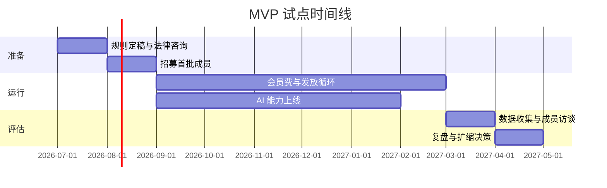
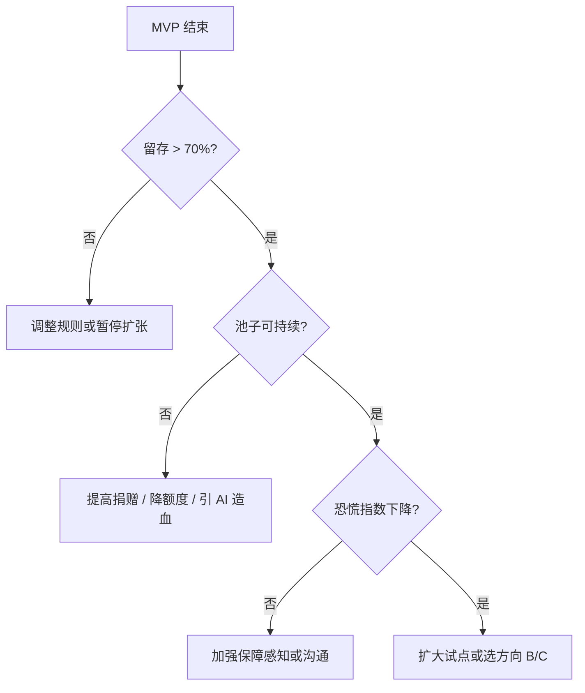

# MVP 试点方案

> **附录 · Phase 1 草案 · 非当前重心**  
> 当前阶段为 [开放概念](../README.md)。本文档保留 **Phase 1 互助基座** 的可能验证路径，**不代表近期执行计划**。  
> 启用前提：Tier 0 分层、透明治理等关键条目已有共识（见 [三期路线图](./mechanism-overview.md#10-三期路线图)）。

## 1. 目标

用 **100–500 人、6–12 个月** 验证：

- 信义分规则是否可执行、可接受
- 集体资金能否可持续支撑最低保障
- AI 能否 measurable 地降本或造血
- 成员主观「未来恐慌」是否下降

---

## 2. 范围边界

**做：**

- 实名 + 信义分（基础 + 贡献）
- 会员费 + 1–2 类必需品（如大米、基础医疗互助）
- 1–2 个 AI 能力（调度 / 透明查询）
- 月度「安心包」发放

**不做（MVP 阶段）：**

- 大规模金融投资
- 复杂链上治理
- 全国扩张
- 全品类必需品覆盖

---

## 3. 阶段计划

---

## 4. 组织准备

| 步骤 | 产出 |
|------|------|
| 确定试点社区 | 地理范围、成员画像 |
| 章程 v0.1 | 信义分、会费、退出规则 |
| 法律主体 | 注册或挂靠合法壳 |
| 专户开立 | 资金与物资分开记账 |
| 招募 100+ 意向成员 | 签署知情同意 |

---

## 5. 信义分 MVP 规则

| 规则 | 数值（示例，可调） |
|------|-------------------|
| 基础分 | 实名 + 签署不作恶承诺 → 每月 +10（成员信用分） |
| 会员费 | 按时缴纳 → 每月 +5（贡献权益分，计入 Tier 1+；不影响 Tier 0） |
| 劳动贡献 | 每次任务 +2~10 |
| 初始分 | 100 分即可领取最低安心包 |

扣分：仅欺诈、恶意占资源；需仲裁庭确认。

---

## 6. 资金 MVP 规则

| 项目 | 示例 |
|------|------|
| 建议会员费 | 50–200 元 / 月（自愿区间，中位数 100） |
| 实物储备 | 大米、食用油（按人数 × 1 月用量） |
| 现金池 | 剩余用于医疗互助应急 |
| 投资 | MVP 暂不投二级市场，仅定存 / 货基级 |

---

## 7. AI MVP 能力

### P0：透明账本助手

- 成员用自然语言查询：池子余额、本月发放、个人额度
- 自动生成月度公开报告

### P0：需求 - 库存匹配

- 根据人数与历史消耗预测补货
- 减少断货与积压

### 成功指标

| 指标 | 目标 |
|------|------|
| AI 降低运营人力 | ≥ 30% 重复性问答自动化 |
| 库存损耗率 | 较无 AI 基线下降 10%+ |

---

## 8. 安心包（示例）

每人每月可领取（信义分 ≥ 100）：

| 内容 | 量 |
|------|-----|
| 大米 | 5 kg |
| 食用油 | 0.5 L |
| 医疗互助 | 池内报销 50%（上限 200 元 / 月） |

高信义分档（≥ 200）：额度上浮 30%。

---

## 9. 评估指标

### 9.1 客观指标

| 指标 | 说明 |
|------|------|
| 留存率 | 6 个月后仍活跃成员占比 |
| 会员费达标率 | 实际会员费 / 承诺会员费 |
| 池子健康度 | 储备 + 现金 ≥ N 月支出 |
| AI 产出 / 成本比 | 造血或节省是否 > 1 |

### 9.2 主观指标

试点前后问卷（1–5 分）：

- 「未来 12 个月基本生活有保障」
- 「失业 / 收入下降时，我知道有退路」
- 「被 AI 替代时，我不至于完全失去依靠」
- 「信任这个系统的规则是公平的」

---

## 10. 复盘决策树

---

## 11. 下一步（MVP 通过后）

1. 引入混合基座型投资篮子（见 [集体资金](./collective-fund.md)）
2. 扩大 AI 对外服务，验证「AI 养人」规模化
3. 与其他社区联盟，共享采购与 AI 基础设施
4. 根据选定方向进入产品化或政策提案
