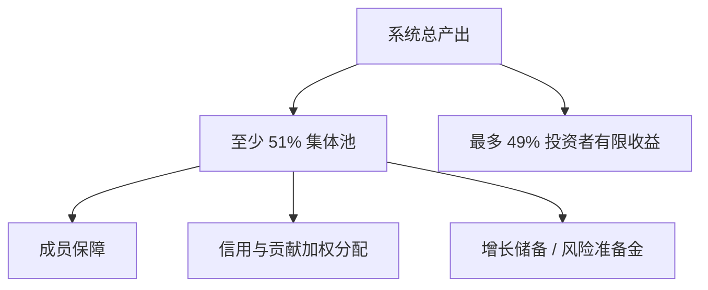
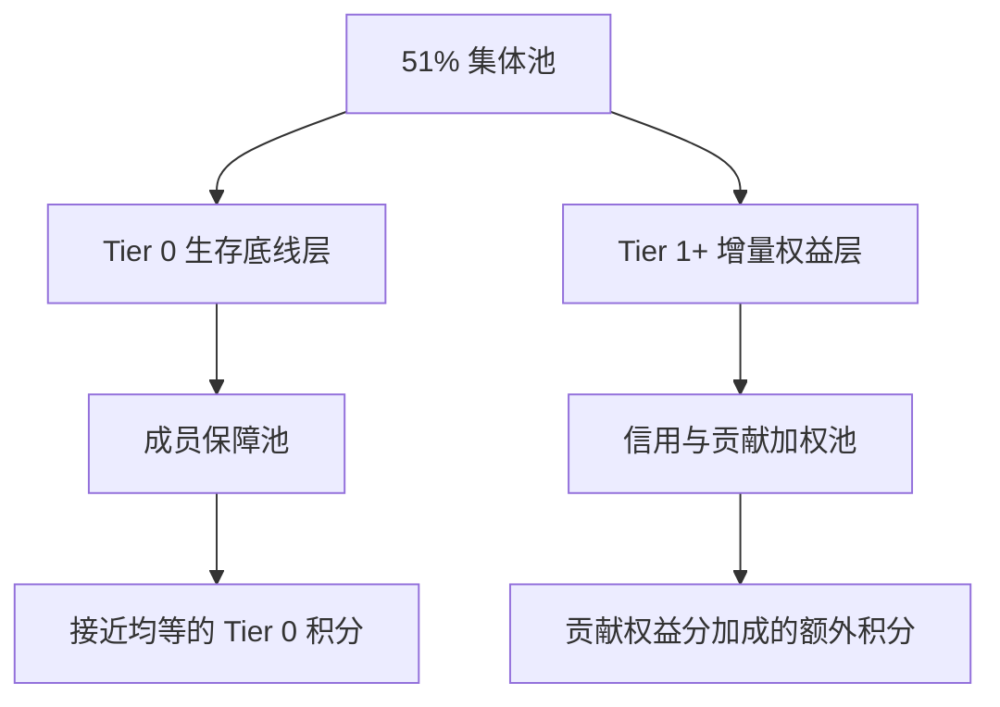
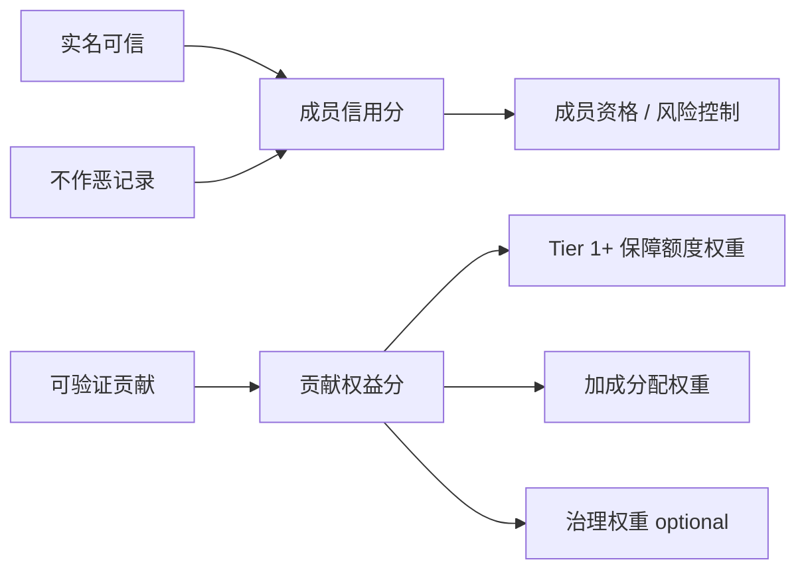

# 所有权与分配机制

> 本文档定义安心基座的核心经济结构：**集体控股、投资者共益、信用与贡献加权分配**。

## 1. 核心原则

安心基座不能走向两个极端：

| 极端 | 问题 |
|------|------|
| 人人无差别均分 | 容易削弱贡献意愿，形成长期搭便车 |
| 资本完全主导 | 系统会被收益最大化逻辑吞掉，保障原则被边缘化 |

因此建议采用：

> **至少 51% 属于集体，最多 49% 属于投资者。**

这里的 51% 不只是收益比例，也代表系统的方向控制权。资本可以参与收益，但不能支配保障原则。49% 也不应是永久、无限的抽成权，而应是**有限回报权**。

---

## 2. 总收益分配

### 2.1 集体部分

集体部分用于三件事：

1. **成员保障**：为系统内成员提供生活必需品底线。
2. **Tier 1+ 信用与贡献加权分配**：按贡献权益权重分配集体增量收益。
3. **增长储备 / 风险准备金**：让池子继续变厚，避免只分不长。

### 2.2 投资者部分

投资者部分用于回报出资、资源、基础设施或早期风险承担。

投资者可以获得收益，但不应获得破坏集体控制权的权利：

- 不能单方面改变保障原则
- 不能控制信义分规则
- 不能要求系统牺牲成员保障来提高短期收益
- 不能通过债权、优先清算、董事席位等安排实际控制系统

投资者收益建议设置至少一种限制：

| 限制 | 含义 |
|------|------|
| 回报封顶 | 达到约定倍数后，投资者分成下降 |
| 期限限制 | 早期享受较高分成，期限后转低比例 |
| 递减分成 | 系统越稳定，投资者比例越低 |
| 优先但有限 | 可以优先回收本金和合理收益，但不能永久占用公共增量 |

---

## 3. 集体池内部拆分

51% 集体池内部建议按三类分配：

| 类别 | 建议比例 | 对应层级 | 作用 |
|------|----------|----------|------|
| 成员保障池 | 30% | **Tier 0** | 成员定期领取、接近均等的 Tier 0 积分 |
| 信用与贡献加权池 | 50% | **Tier 1+** | 贡献权益分加成的增量 |
| 增长储备 / 风险准备池 | 20% | — | 补充资产、抗风险、扩大保障能力 |

比例只是概念阶段的默认模板，未来可按社区规模、资产厚度、成员结构调整。

---

## 4. 保障分层（Tier 0 / Tier 1+）

集体池内的成员-facing 分配拆成两层，解决「宽松托底」与「贡献有价」的内在张力：

### 4.1 Tier 0 — 生存底线层

> **实名 + 不作恶 + 成员资格 → 成员定期领取接近均等的 Tier 0 积分。**

- **回答的问题**：基本生活会不会塌？
- **发放方式**：按固定周期（建议每月）向合格成员发放 Tier 0 积分，形成可预期的领取节律
- **分配规则**：同一周期内，合格成员领取的 Tier 0 积分**接近均等**；不因贡献多寡拉开差距
- **使用方式**：积分用于兑换直供型必需品（粮食、基础物资、基础能源等），兑换时优先履约
- **成员信用分的作用**：仅做风控——暂停当周期发放、恢复、申诉；**不用于** Tier 0 额度分级
- **失去 Tier 0 的条件**：仅事后认定的作恶、欺诈、损害集体利益且未恢复者

### 4.2 Tier 1+ — 增量权益层

> **贡献权益分加权 → 额外积分、应急优先、治理权重。**

- **回答的问题**：多做有没有回报？
- **分配规则**：信用与贡献加权池按贡献权益分（及可选的长期参与、治理参与）分配**增量**
- **约束**：加权须有上限、可申诉、可恢复，避免形成新阶级

Tier 1+ 覆盖额外保障、应急通道优先、医疗 / 住房等补贴型权益的加成部分。

### 4.3 与集体池子池的映射

| 集体池子池 | 对应层级 | 建议占成员-facing 分配 |
|------------|----------|-------------------------|
| 成员保障池 | Tier 0 | ≥ 40% |
| 信用与贡献加权池 | Tier 1+ | 其余（设加权上限） |

---

## 5. 成员保障池 — 已纳入 Tier 0 / Tier 1+ 分层

Tier 0 层接近均等；Tier 1+ 层才按贡献加权。详见 [保障分层](./ownership-and-distribution.md#4-保障分层tier-0--tier-1)。

- 不作恶者不会被 Tier 0 排除（观察期后按周期定期领取接近均等的积分）
- 长期不贡献者仍可保留 Tier 0，但 Tier 1+ 增量有限
- 贡献者、守信者、参与治理者在 Tier 1+ 获得更多积分与优先权

---

## 6. 信用与贡献加权规则

从经济学角度，信义分最好拆成两类，避免一个分数同时管资格和收益：

| 分数 | 回答的问题 | 用途 |
|------|------------|------|
| 成员信用分 | 这个人是否可信、是否破坏系统？ | 准入、风控、申诉、惩罚 |
| 贡献权益分 | 这个人为系统创造了多少可验证价值？ | 集体池分配、加成、治理权重 |

对外仍可统称「信义分」，但内部机制应区分这两个维度。

建议公式方向：

> **Tier 0 积分** ≈ 均等基准 × 成员资格状态（正常 / 暂停），**按周期定期发放**  
> **Tier 1+ 可分配额度** = 贡献权益权重 × 当期 Tier 1+ 池可分配总量（设上限）

概念阶段不设具体公式，但要保留四个约束：

1. **Tier 0 接近均等**：合格成员间 Tier 0 差距有硬上限（建议最高 / 最低 ≤ 1.5）。
2. **Tier 1+ 贡献有明显收益**：贡献者应能感到「多做不白做」。
3. **Tier 1+ 上限防阶级化**：高分者不能无限拉开差距。
4. **扣分需审慎**：惩罚必须少见、可申诉、可恢复；默认影响 Tier 1+ 与资格状态，而非剥夺 Tier 0 除非严重作恶。

---

## 7. 为什么是 51 / 49

51 / 49 的意义不是数学精确，而是表达一种制度边界：

| 比例 | 含义 |
|------|------|
| 至少 51% 集体 | 保障原则优先，集体拥有最终方向控制权 |
| 最多 49% 投资者 | 允许资本、资源、基础设施参与，并获得足够但有限的激励 |

这个结构试图同时回答两个问题：

- **没有投资者，系统如何扩大资产？**
- **投资者进来后，系统如何不被资本逻辑控制？**

---

## 8. 分配一句话

**系统由集体控股，收益由集体与投资者共享；投资者有利但有限。Tier 0 接近均等托底，Tier 1+ 按贡献加权分配增量，同时保留增长储备和风险准备金。**
