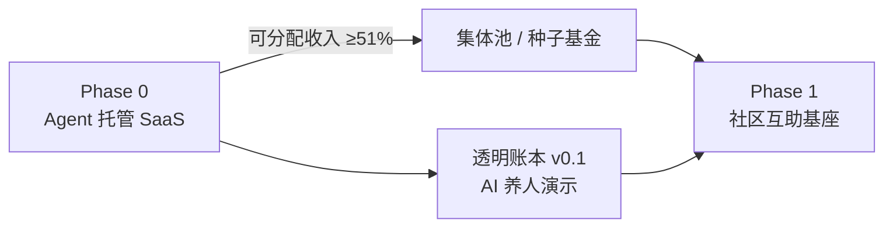
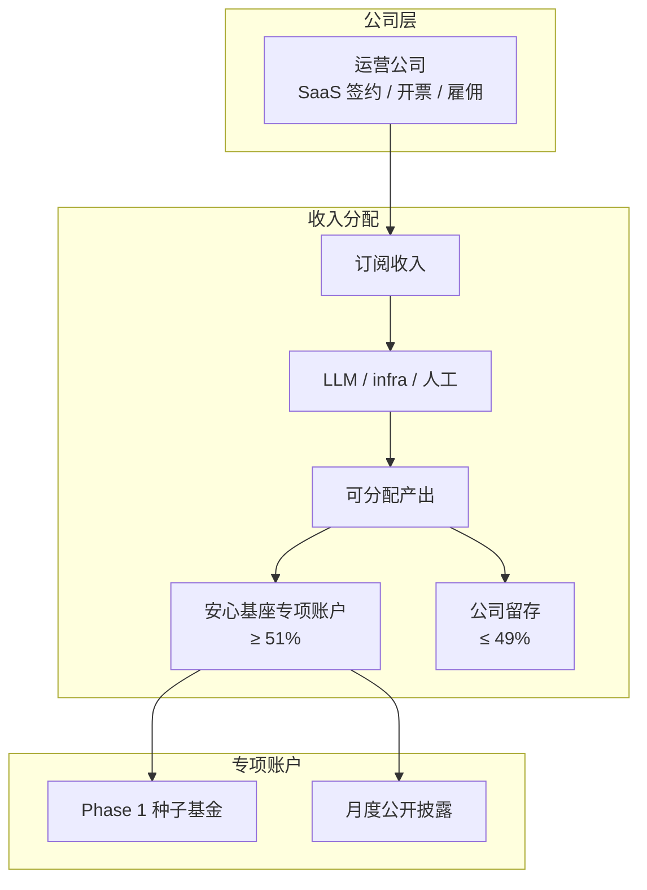
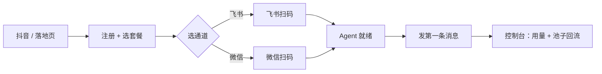
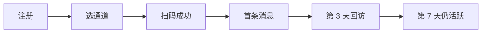
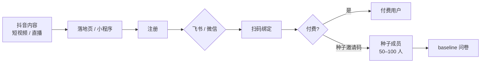
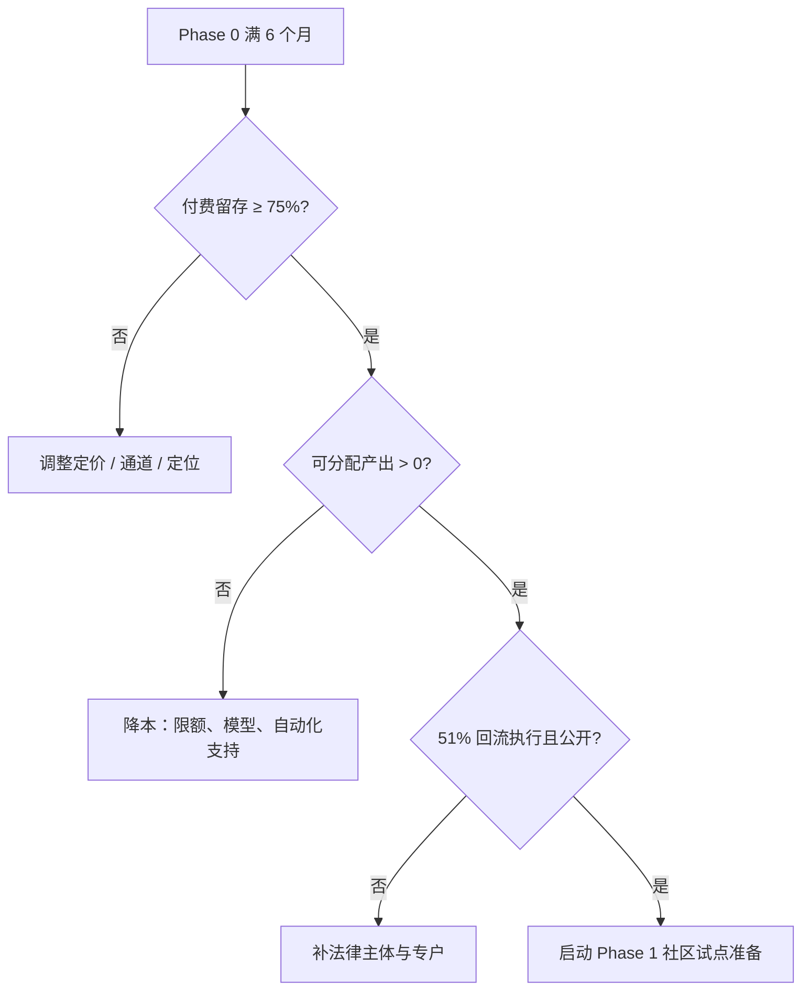
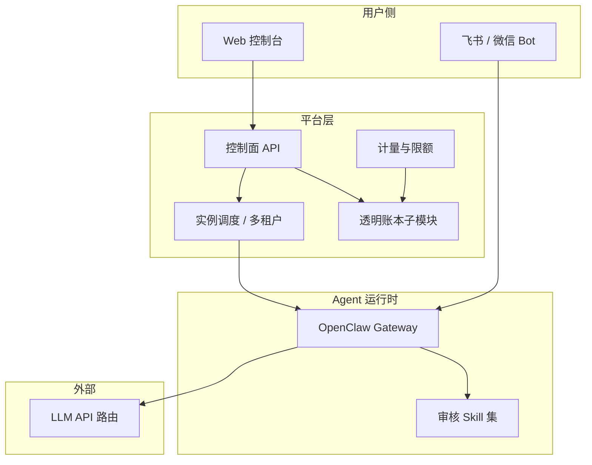
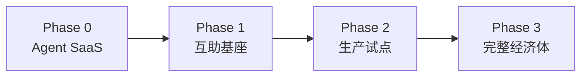

# Phase 0 · Agent 托管产品方案

> **草案 · 首个可收费产品**  
> **已决（2026-06-14）**：MVP 通道 **飞书 + 微信**（扫码绑定，用户二选一）· 法律主体 **公司** · 种子成员来源 **抖音**  
> 定位：在 Phase 1 社区互助启动前，用 **个人 AI Agent 托管 / 一键部署** 产生真实现金流，并作为「AI 养人」的第一个可触摸实例。  
> 依据：[AI 养人](./ai-productivity.md) · [推演模型](../plans/2026-06-13-simulation-model.md) · [MVP 试点](./mvp.md) · [Phase 0 决议](../decisions/2026-06-14-phase-0-product-decisions.md)

---

## 1. 为什么需要 Phase 0

Phase 1 互助基座的设计已闭合，但冷启动存在结构性障碍：

| 问题 | 推演结论 |
|------|----------|
| 100 人社区 | 纯会员费不可持续，需种子资助或大幅降本 |
| 500 人社区 | 调整后月盈余 ~1,500 元，18 个月才达 3 月储备 |
| Phase 1 AI ROI | < 1 可接受，短期是成本中心而非利润中心 |

**Phase 0 的作用**：用对外 SaaS 收入解决「缺种子金」问题，同时验证 AI 对外造血、透明账本、51% 回流等机制承诺——**不等 500 人社区凑齐，先有一个能跑、能收钱、能公开账的产品**。



Phase 0 **不替代** Phase 1：Tier 0、信义分、必需品兑换仍须在社区实验中验证。Phase 0 解决的是 **钱从哪来** 和 **叙事如何被看见**。

---

## 2. 产品定义

### 2.1 一句话

> **安心 Agent** — 5 分钟拥有你的个人 AI 助手；收入的一部分，公开回流集体池。

### 2.2 解决的用户痛点

基于 [OpenClaw](https://github.com/openclaw/openclaw) / [Hermes Agent](https://hermes-agent.org/) 等开源框架的共性门槛：

| 痛点 | 本产品 |
|------|--------|
| 自托管配置复杂（Gateway、Channel、Skill） | 托管 + 向导式 onboarding |
| 多平台绑定繁琐 | **飞书 / 微信扫码一键绑定** Bot |
| 安全默认弱、Skill 不可信 | 预加固沙箱 + 审核 Skill 白名单 |
| API Key / 模型选型困惑 | 打包算力 + 模型分级路由 |
| 不知道 AI 增值归谁 | **月度公开：本月 X% 回流集体池** |

### 2.3 目标用户（ICP）

| 优先级 | 用户 | 特征 |
|--------|------|------|
| P0 | **想用但不会装** 的个人用户 | 日常用飞书或微信、怕 AI 替代、非开发者；多从 **抖音** 转化 |
| P1 | 小团队（5–20 人） | 飞书协作场景，需要共享 Agent |
| P2 | 其他互助组织 / 合作社 | Phase 2 白标或 B2B |

**获客主渠道**：抖音短视频 / 直播 → 落地页 → 注册 → **选飞书或微信** → 扫码绑定。**种子成员与 Phase 1 社区不要求同一地理圈**，先形成线上认同圈，Phase 1 再选线下试点城市。

Phase 0 **不做**：QQ 接入；企业级 SSO / 多租户复杂权限（见 §8）。

### 2.4 已决事项（2026-06-14）

| # | 决策 | 含义 |
|---|------|------|
| 1 | **MVP 通道：飞书 + 微信** | 用户 onboarding 时 **二选一**；均支持 App 扫码完成 Bot 登录 |
| 2 | **法律主体：公司** | 以有限责任公司运营 SaaS；可分配产出 ≥51% 转入 **安心基座专项账户**（见 §3.5） |
| 3 | **种子成员：抖音** | 通过抖音内容获客与招募 50–100 种子用户；线上社区先行，非地理绑定 |

### 2.5 与开源框架的关系

| 框架 | 角色 | 选用场景 |
|------|------|----------|
| **OpenClaw** | 默认后端 | **飞书**（内置通道）+ **微信**（[`@tencent-weixin/openclaw-weixin`](https://github.com/Tencent/openclaw-weixin) 官方插件） |
| **Hermes Agent** | 可选后端（Phase 0.2） | 记忆 / 技能复利；飞书通道待评估 |

定位是 **托管与 Setup 层**，不是 fork 竞争：贡献 upstream、明确 attribution、遵守各自许可。

### 2.6 价值主张与触点分层

「AI 养人 / 51% 回流」是差异化，但**付费决策通常发生在前 30 秒**——用户先要相信「这个 Agent 对我有用」。

| 触点 | 主信息 | 辅信息 |
|------|--------|--------|
| 抖音短视频 | 「5 分钟，飞书 / 微信里有个 AI 助手」 | 结尾 1 句：收入 51% 公开回流 |
| 落地页首屏 | 具体场景（写周报、记待办、查资料） | 51% 作为信任徽章 |
| 付费页 / 账单 | 价格 + 限额清晰 | 本月池子回流金额（可点击查看明细） |

**产品原则**：若首月留存 < 60%，优先改 **Aha 时刻**（首条有用回复），而不是加强公益叙事。51% 是留存后的「理由继续付」，不是拉新的主钩子。

**Phase 0 成功公式（PM 视角）**：

> 先让用户在熟悉的 IM 里获得可重复的「小胜利」，再用透明账本把「付费」变成「参与集体造血」——而不是反过来用叙事换留存。

### 2.7 与自装 OpenClaw 的差异

目标用户会搜「OpenClaw 教程」。落地页需明确对比，**不贬低 upstream**：

| | 自装 OpenClaw | 安心 Agent |
|--|---------------|------------|
| 时间 | 数小时 | ~5 分钟 |
| 安全 | 自备 Skill，风险自担 | 沙箱 + 白名单 |
| 成本 | 自购 API，易超支 | 套餐含额度 |
| 意义 | 个人工具 | 工具 + 集体回流 |

强调 **Setup + 安全 + 算力打包 + 机制透明** 的托管层定位。

---

## 3. 与安心基座机制的衔接

### 3.1 不变量对齐

| 不变量 | Phase 0 如何体现 |
|--------|-----------------|
| I4 AI 增量优先归集体 | 可分配收入 ≥ **51%** 入池（章程 / 产品页写死） |
| I5 公开透明 | 月度收支 + 池子回流公开；产品内可查 |
| I6 可自由退出 | 随时取消订阅、导出数据、删实例 |
| I7 集体 51% 控制 | 公司运营，**可分配产出 ≥51%** 入安心基座专项账户；公司保留 ≤49% 用于再投资与合规成本 |
| I10 外销引入增长 | 对外 SaaS 即外环造血 |

### 3.2 双轨用户

| 类型 | 权益 | 目的 |
|------|------|------|
| **付费用户**（公众） | 全价订阅 + 完整 Agent 能力 | 造血 |
| **种子成员**（50–100 人） | 折扣或基础额度免费；参与问卷与访谈 | 验证留存与「恐慌指数」 |

种子成员从 **抖音** 转化，同时作为 Phase 1 线上预备队；Phase 1 线下试点城市 **另行选定**，不与种子获客渠道绑定。

**种子成员分层**（避免低质量样本）：

| 层级 | 规模 | 权益 | 义务 |
|------|------|------|------|
| **深度种子** | ~30 人 | 基础档 6 个月免费 | 双周访谈 + 功能共创 |
| **广度种子** | ~70 人 | 基础档 6 个月免费或 5 折 | baseline 问卷 + NPS |

| 机制 | 说明 |
|------|------|
| **可见贡献** | 控制台显示「您参与的反馈已影响 v0.x」（汇总采纳条数即可） |
| **恐慌指数** | baseline 问卷 + **第 30 / 90 天复测**，作为 Phase 1 启动输入之一 |
| **Phase 1 桥接** | 可选登记「愿意参与线下试点城市调研」，不强制同城 |

### 3.5 公司法人与 51% 入池（已决：公司）

以 **有限责任公司** 作为 Phase 0 运营主体，结构示意：



| 项目 | 规则（示意，章程 / 股东协议定稿） |
|------|----------------------------------|
| 运营主体 | 有限责任公司，对外 SaaS 签约主体 |
| 专项账户 | 公司名下 **独立银行账户** 或经审计的专户子账，仅用于集体池 |
| 入池比例 | 每季度可分配产出 **≥ 51%** 转入专项账户 |
| 入池基数 | **可分配产出**（扣 LLM、基础设施、必要人工后），非毛收入 |
| 公开 | 月度摘要：收入区间、成本区间、入池金额、专项账户累计余额 |
| 公司留存 | ≤ 49% 用于产品迭代、安全、客服、税务与合规 |

**待办（启动前）**：公司章程或股东决议写入分配原则；专项账户开立；首年财务与入池由第三方或定期公示佐证。

**与 Phase 3 51/49 的关系**：Phase 0 是 **公司内部分配**，不是股权层面的 51/49 投资者结构；Phase 3 再引入外部资本与正式集体控股架构。

### 3.3 收入分配（Phase 0 简化）

可分配收入 = 订阅收入 − LLM/API 直接成本 − 基础设施 − 必要人工

| 用途 | 比例（示意，落地可调） |
|------|------------------------|
| 集体池 / 种子基金 | **≥ 51%** |
| 运维与再投资（产品迭代、安全） | ≤ 35% |
| 协作者 / 早期贡献者 | ≤ 14%（含 Tier 1+ 逻辑预演） |

**优先覆盖运维**（见 [AI 养人 §4](./ai-productivity.md#4-价值分配原则)）：51% 指 **可分配产出**，不是毛收入。

### 3.4 Phase 0 验证什么 / 不验证什么

| 验证 | 不验证 |
|------|--------|
| AI 对外造血能否产生正现金流 | Tier 0 实物兑换全流程 |
| 透明账本能否建立信任 | 500 人社区规模经济 |
| 51% 回流能否可持续执行 | 51/49 投资者结构 |
| 用户是否认可「AI 养人」叙事 | 农业 / 基础工业资产 |
| 种子成员主观「恐慌指数」变化 | 完整信义分仲裁体系 |

### 3.6 51% 入池产品化

信任是 Phase 0 核心验证项。MVP 即将透明机制**产品化**（不必等审计完善）：

| 功能 | 用户看到什么 | 信任效果 |
|------|--------------|----------|
| 控制台「集体池」卡片 | 本月入池金额、累计、占可分配产出比例 | 每次登录强化叙事 |
| 订阅确认页 | 「您本月约 X 元中的 Y 元进入集体池」 | 付费时不觉得「纯商业」 |
| 月度 PDF / 静态页 | 收入区间、成本区间、入池凭证截图 | 对外传播素材 |
| 首年里程碑 | 「入池满 1 万 / 5 万」公开庆祝 | 抖音二次传播 |

**合规表述**：统一使用「可分配产出」「约」等措辞；避免暗示理财回报；产品文案经法务模板审核。

---

## 4. MVP 范围

### 4.1 做（8 周内可交付）

**资源紧张时的优先级**（见 §4.7）：双通道任一不稳定都会拖垮抖音演示；可 **先微信公测 2 周再开飞书**，优于「两个半残」。

| 阶段 | 功能 | 说明 |
|------|------|------|
| **必保**（没有就不该上线） | 单通道扫码绑定 | 抖音默认 **微信优先**；飞书可 Phase 0.1 跟进 |
| **必保** | 预配置 Agent 实例 | OpenClaw Gateway 托管；用户无需碰 CLI |
| **必保** | Web 控制台 | 用量、订阅、实例开关、集体池卡片（§3.6） |
| **必保** | 用量硬限额 + 硬停 | 控 LLM 成本；超额加价可 Phase 0.1 |
| **必保** | Aha + 基础 Skill（3 个） | 扫码成功后推送预制首问（§4.7） |
| **必保** | 透明账本 v0.1 | 月度公开 + 控制台「本月池子回流」（可先手工汇总） |
| **必保** | 取消订阅 + 数据导出 | I6 可自由退出 |
| **Phase 0.1**（上线后 2 周） | 第二 IM 通道 | 微信稳定后再开飞书，或反之 |
| **Phase 0.1** | 模型分级路由 | 简单任务用小模型 |
| **Phase 0.1** | 精选 Skill 包（5–10 个） | 白名单审核，不开放任意 ClawHub |
| **Phase 0.1** | 种子 onboarding 自动化 | 抖音来源标记、邀请码、baseline 问卷 |

### 4.2 不做（Phase 0）

| 不做 | 原因 |
|------|------|
| 其他 IM（Telegram / Discord / QQ 等） | MVP 聚焦国内飞书 + 微信 |
| 单用户同时绑定双通道 | Phase 0.2；MVP 套餐含 **1 个通道**，注册时二选一 |
| 开放 Skill 市场 | 安全面不可控 |
| 多 Agent 编排 / 企业 SSO | 超出 MVP |
| 链上账本 | Phase 1 透明 CSV / 报告即可 |
| Tier 0 积分 / 信义分完整系统 | 留 Phase 1；Phase 0 仅记录种子成员贡献 |

### 4.3 用户旅程（目标 ≤ 5 分钟）



### 4.4 飞书绑定（技术要点）

基于 OpenClaw 内置 [Feishu 通道](https://docs.openclaw.ai/channels/feishu)（WebSocket 默认）：

| 步骤 | 用户侧 | 平台侧 |
|------|--------|--------|
| 1 | 选择「飞书」→ 点击绑定 | 拉起 OpenClaw channel 向导 |
| 2 | **飞书 App 扫码** | 自动创建 Custom App + Bot，或引导粘贴 App ID / Secret |
| 3 | 在飞书中向 Bot 发首条消息 | Gateway WebSocket 就绪 |
| 4 | 控制台「已连接」 | 开启计量与 Skill 白名单 |

**版本**：OpenClaw ≥ 2026.5.29（以官方文档为准）。Lark 国际租户配置 `domain: "lark"`。

### 4.5 微信绑定（技术要点）

基于腾讯官方插件 [`@tencent-weixin/openclaw-weixin`](https://github.com/Tencent/openclaw-weixin)（[OpenClaw 文档](https://docs.openclaw.ai/channels/wechat)）：

| 步骤 | 用户侧 | 平台侧 |
|------|--------|--------|
| 1 | 选择「微信」→ 点击绑定 | 控制台展示二维码（或调起 `openclaw channels login --channel openclaw-weixin`） |
| 2 | **微信 App 扫码并确认授权** | 插件保存登录凭证至实例状态目录 |
| 3 | 在微信中向 Agent 发首条消息 | ilink 长轮询连接就绪 |
| 4 | 控制台「已连接」 | 开启计量与 Skill 白名单 |

**安装（平台预装，用户无感）**：

```bash
openclaw plugins install "@tencent-weixin/openclaw-weixin"
openclaw config set plugins.entries.openclaw-weixin.enabled true
```

**版本**：OpenClaw ≥ **2026.3.22**（微信插件 2.x）；与飞书通道版本要求取 **较高者** 作为平台基线。

**说明**：采用腾讯 **官方 ClawBot / openclaw-weixin 插件**（ilink 协议 + 扫码授权），**非** 网页版微信桥接或第三方个人号方案，降低封号风险。当前插件以 **私聊 / 单聊** 为主；群聊能力按插件 metadata 迭代。

### 4.6 通道共性（隔离与安全）

| 原则 | 说明 |
|------|------|
| **实例隔离** | 每用户独立 Gateway + 独立通道凭证，禁止多用户共用一个 Bot / 微信号 |
| **DM 默认** | 飞书 pairing / allowlist；微信单聊 |
| **群组** | 飞书群默认需 @mention；微信群 Phase 0 不承诺 |
| **Skill** | 白名单审核；敏感操作 human-in-the-loop |

### 4.7 激活漏斗与 Aha 时刻

「绑定到首条消息 ≤ 5 分钟」须拆为**可运营漏斗**，控制台埋点：



| 阶段 | 建议目标 | 若卡住则优先排查 |
|------|----------|------------------|
| 注册 → 选通道 | > 90% | 套餐 / 通道选择太复杂 |
| 选通道 → 扫码成功 | > 80% | 飞书 / 微信授权失败、文案不清 |
| 扫码 → 首条消息 | > 70% | 不知道发什么、Bot 无响应 |
| 首条 → 第 7 天活跃 | > 40% | 没有「第二天理由回来用」 |

**关键产品动作**：扫码成功后不只显示「已连接」，推送 **3 条预制首问**，例如：

- 「帮我总结今天待办」
- 「解释这段文字」
- 「写一条礼貌回复」

---

## 5. 定价与单位经济（示意）

> 数值为推演用，上线前须 A/B 测试与成本实测。

### 5.1 套餐草案

| 套餐 | 月费 | 包含 |
|------|------|------|
| **基础** | 49 元 | **飞书或微信 1 通道**、5 万 token / 月、基础 Skill |
| **标准** | 99 元 | **飞书或微信 1 通道**、20 万 token / 月、精选 Skill + 优先模型 |
| **体验** | 9.9 元 / 7 天 | 低决策成本入门；限额更严（如 5k token） |
| **Setup 一次性** | 199 元（可选） | 仅对「扫码失败 2 次」用户弹出，**非**默认展示 |

| 补充 | 说明 |
|------|------|
| **年付折扣** | 如基础 499 / 标准 899 元，提高 LTV、减少月 churn 噪音 |
| **退款政策** | 7 天内未激活全额退；已激活按用量比例退（降低首购焦虑） |

种子成员：基础档 **6 个月免费** 或 **5 折**，换取出题与访谈配合（分层见 §3.2）。

### 5.2 单位经济（500 付费用户目标态）

| 项目 | 假设 | 月金额 |
|------|------|--------|
| 订阅收入 | 500 × 69 元（混合均价） | 34,500 元 |
| LLM + API 成本 | 500 × 30 元 | -15,000 元 |
| 服务器 + 带宽 | 固定 + 人均 | -4,000 元 |
| 支持与运维（0.5 FTE） | | -8,000 元 |
| **可分配产出** | | **~7,500 元** |
| 集体池（51%） | | **~3,825 元** |
| 再投资 + 协作者（49%） | | ~3,675 元 |

**盈亏平衡点（粗算）**：约 **200–250 付费用户**（视均价与 API 成本而定）。

与 [推演模型](../plans/2026-06-13-simulation-model.md) 对照：500 人社区 Phase 1 月盈余 ~1,500 元；Phase 0 在 500 付费用户时集体池 ~3,825 元 / 月，**可覆盖 Phase 1 种子资助需求**。

### 5.3 抖音获客与种子成员（已决：抖音）



| 环节 | 做法 |
|------|------|
| **内容主题** | 「5 分钟在飞书 / 微信拥有 AI 助手」「AI 替代焦虑 → 你的 Agent 也在为你打工」「订阅收入的 51% 公开回流集体池」 |
| **转化路径** | 视频挂落地页 → 注册 → **选通道** → 扫码 → 首条对话录屏作 UGC |
| **种子成员** | 抖音粉丝 / 直播观众中招募 50–100 人；基础档 6 个月免费，换问卷 + 可选访谈 |
| **与 Phase 1** | 种子成员为 **线上认同圈**，不要求同城；Phase 1 线下试点城市 **单独选址** |
| **追踪** | UTM / 邀请码区分抖音来源；控制台标记 `source=douyin` |

**内容矩阵**（抖音适合 15–30 秒场景，不宜纯概念）：

| 内容类型 | 示例 | 目的 |
|----------|------|------|
| 痛点共鸣 | 「老板在飞书 @ 你，30 秒让 AI 起草回复」 | 拉新 |
| 对比演示 | 左：自装 OpenClaw 2 小时；右：扫码 3 分钟 | 转化 |
| 信任背书 | 录屏：控制台「本月 X 元入池」 | 差异化 |
| UGC 激励 | 种子用户发「我的 Agent 第一条神回复」 | 裂变 |

**运营建议**：

- 前 20 条视频**固定 2 个场景**（办公回复 + 生活备忘），不每条换概念。
- 落地页默认通道：**微信优先**（抖音受众）；飞书作「上班族进阶版」或独立子账号投放。
- 种子邀请码与付费链路分开 A/B：避免种子码稀释付费转化。

**抖音侧注意**：落地页需 ICP 备案；付费链路可用微信 / 支付宝；避免「保本 / 理财」类表述，强调 **工具订阅 + 透明公益分配**。

### 5.4 获客经济（CAC 上限）

单位经济假设均价 69 元、盈亏平衡 200–250 人——须设定 **CAC 上限**（可接受获客成本 ≤ 首月 ARPU 的 50%，即约 **35 元 / 付费用户**）。

| 假设 | 需验证 |
|------|--------|
| 抖音播放 → 注册转化率 | 内容矩阵 A/B（§5.3） |
| 注册 → 付费转化率 | 体验包 9.9 元 vs 直接 49 元 |
| 最坏情况播放量 | 若转化仅 1–2%，倒推达 200 付费所需曝光量 |

---

## 6. 成功指标

### 6.1 North Star（Phase 0）

> **付费用户月留存率 × 可分配产出为正**

即：有人持续付钱，且扣除直接成本后有钱可回流池子。

### 6.2 一级指标

| 类别 | 指标 | Phase 0 目标（6 个月） |
|------|------|------------------------|
| 商业 | 付费用户数 | ≥ 200 |
| 商业 | 月留存 | ≥ 75% |
| 商业 | 可分配产出 | 连续 3 个月 > 0 |
| 机制 | 集体池累计回流 | 公开可查，≥ 51% 执行 |
| 产品 | 绑定到首条消息 | 中位数 ≤ 5 分钟 |
| 产品 | 支持工单 / 用户比 | ≤ 1:50 |

### 6.3 二级指标（衔接 Phase 1）

| 指标 | 目标 |
|------|------|
| 种子成员数 | 50–100 |
| 「未来 12 个月基本生活有保障」问卷 | baseline 已采集 |
| AI 产出 / 成本比 | Phase 0 目标 ≥ 0.8（对外造血优于 Phase 1 内环） |
| 恐慌指数复测 | 种子成员第 30 / 90 天 vs baseline |

### 6.4 领先指标（每周复盘）

North Star 为滞后指标。建议同步跟踪：

| 领先指标 | 说明 |
|----------|------|
| **WAU / MAU**（活跃订阅用户） | 比月留存更早报警 |
| **每用户周对话轮数** | 用量是否真在用 |
| **超额 / 升级率** | 是否愿意付更多 |
| **支持工单主题 Top 3** | 产品缺陷雷达 |
| **抖音：播放 → 注册转化率** | 内容是否有效 |
| **激活漏斗各阶段**（§4.7） | 定位 onboarding 卡点 |

### 6.5 90 天 checkpoint

6 个月目标为 ≥ 200 付费 + 75% 月留存。建议 **90 天**设中间检查点，未达标则提前触发 §6.6 决策树：

| 指标 | 90 天 checkpoint |
|------|------------------|
| 付费用户数 | ≥ 50 |
| 月留存 | ≥ 70% |
| 可分配产出 | 连续 2 个月 > 0 |

未达标 → 调价 / 单通道聚焦 / 改 ICP，**不必等满 6 个月**。

### 6.6 复盘决策树



---

## 7. 技术架构（概要）



| 组件 | Phase 0 选择 |
|------|--------------|
| 控制面 | 自研轻量后端 + 数据库 |
| Agent 运行时 | OpenClaw Gateway + Feishu 内置通道 + Weixin 官方插件 |
| 账本 | PostgreSQL + 月度 CSV / 静态页公开 |
| 认证 | 手机号 / 邮箱；通道绑定通过扫码向导 |

**安全基线**：实例网络隔离、Skill 白名单、Secrets 不进 prompt、敏感操作人工复核。

---

## 8. 风险与应对

| 风险 | 严重度 | 应对 |
|------|--------|------|
| LLM 成本失控 | 高 | 硬限额、超额加价、小模型路由 |
| OpenClaw / 双通道安全 | 高 | 跟进 CVE；每用户实例隔离；仅用微信 **官方 openclaw-weixin 插件** |
| Mission drift（变普通 SaaS） | 高 | 首页与账单展示 51% 回流；月度公开；**产品评审 checklist**：每条需求是否强化 I4 / I5 / I10 |
| 首购决策成本高 | 中 | 7 天体验包（§5.1）；退款政策明示 |
| 双通道同时半残 | 中 | 单通道先稳再开第二通道（§4.1） |
| 客服人力不足 | 中 | MVP：Agent 答 FAQ + 人工兜底工单；目标支持比 ≤ 1:50 |
| 飞书 Bot 审核 / 权限 | 中 | 遵循开放平台规范；MVP 以 DM 私聊为主 |
| 微信插件版本耦合 | 中 | 平台基线 OpenClaw ≥ 2026.3.22；飞书通道取更高版本 |
| 抖音获客合规与转化 | 中 | 备案落地页；内容避免理财承诺；明确订阅性质 |
| 线上种子圈与 Phase 1 地理试点脱节 | 中 | Phase 0 只验证产品与叙事；Phase 1 单独选城 |
| 不验证 Phase 1 核心机制 | 中 | 50+ 种子成员 baseline 问卷 |
| QQ 未接入 | 低 | Phase 0 刻意不做 |
| 与上游项目关系 | 中 | 托管层定位、合规贡献、许可遵守 |
| 专项账户与章程 | 中 | 公司注册 + 股东决议 + 专户开立（见 §3.5） |

---

## 9. 与三期路线关系



| 阶段 | AI 角色 | 本方案 |
|------|---------|--------|
| **Phase 0** | 对外造血 + 透明账本演示 | **本文档** |
| Phase 1 | 内环降本 + 成员服务 | [MVP 试点](./mvp.md) |
| Phase 2 | 扩展外环 + 单资产 | 可 B2B 白标 |
| Phase 3 | 完整 AI 养人闭环 | 51/49 结构 |

[机制总览 §10](./mechanism-overview.md#10-三期路线图) 三期路线图扩展为 **Phase 0 → 1 → 2 → 3**；Phase 0 为可选但推荐的冷启动路径。

---

## 10. 启动清单（Phase 0 前 90 天）

| 周 | 动作 | 产出 |
|----|------|------|
| 1–2 | 飞书 + 微信双通道 spike | 两条扫码绑定 POC、实例隔离方案 |
| 2–3 | **公司注册** + 专项账户 + 分配决议草案 | 运营主体与 ≥51% 入池机制 |
| 3–4 | 落地页（备案）+ 抖音内容脚本 3–5 条 | 等候名单 + 种子邀请码 |
| 4–8 | MVP 开发（单通道优先 + 控制台 + 账本 v0.1 + 激活漏斗埋点） | 内测版 |
| 6–8 | 抖音内测招募 20 人 + 种子 30 人 | baseline 问卷 |
| 8–10 | 单通道公测 + 第二通道 Phase 0.1 | 50 付费（90 天 checkpoint 起点） |
| 10–12 | 抖音公测 + 迭代 | 200 付费用户 OR 复盘 pivot（§6.5–6.6） |

---

## 11. 开放问题

| # | 问题 | 状态 |
|---|------|------|
| 1 | MVP 通道 | ✅ **飞书 + 微信**（注册时二选一，均扫码绑定） |
| 2 | 法律主体 | ✅ **公司** |
| 3 | 种子成员来源 | ✅ **抖音**（线上圈，非地理绑定） |
| 4 | 51% 专项账户细则 | 待章程 / 股东决议定稿 |
| 5 | 产品正式名称（「安心 Agent」为工作名） | **待定**（建议 2 周内定 3 候选做用户测试） |
| 6 | Hermes 双后端 | 建议 Phase 0.2 |
| 7 | Phase 1 线下试点城市 | 待 Phase 0 跑通后选定 |
| 8 | 落地页默认通道 | 建议 **微信优先**（抖音）；飞书独立办公向投放 |
| 9 | 退款政策细则 | 原则见 §5.1；待法务定稿 |
| 10 | 体验包 vs 直接订阅 A/B | 待公测前确定 |

决议全文见 [Phase 0 产品决议](../decisions/2026-06-14-phase-0-product-decisions.md)。

---

## 12. 相关文档

- [AI 养人](./ai-productivity.md) — 价值分配与伦理边界
- [MVP 试点方案](./mvp.md) — Phase 1 社区互助
- [推演模型](../plans/2026-06-13-simulation-model.md) — 规模与可持续
- [治理与风险](./governance-and-risks.md) — 透明与申诉原则
- [张力与开放问题](../philosophy/tensions-and-open-questions.md)

---

## 13. 一句话

**Phase 0 用可收费的 Agent 托管产品产生真实现金流与公开账本，为 Phase 1 社区互助提供种子金与「AI 养人」的第一个证据——不是替代安心基座，而是让它不必永远停在文档里。**
