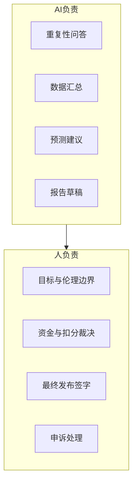

# AI 使用边界草案 v0.1

> 状态：草案 · 非执行  
> 依据：[AI 养人](../design/ai-productivity.md)、[P0 机制决议](../decisions/2026-06-13-p0-mechanism-resolutions.md)

## 1. 原则

- AI 产出归属**集体**
- AI 为系统降本与造血，不替代 human-in-the-loop 敏感决策
- 使用范围、产出、成本**公开**

---

## 2. Phase 1 允许的能力（P0）

| 能力 | 用途 | 边界 |
|------|------|------|
| **透明账本助手** | 自然语言查询池子余额、个人额度、发放记录 | 只读；不自动划拨资金 |
| **需求 - 库存匹配** | 预测补货、减少断货与积压 | 建议须人工确认后执行 |
| **月度报告生成** | 自动生成公开披露草稿 | 须人工审核后发布 |

---

## 3. Phase 1 禁止的能力

| 能力 | 原因 |
|------|------|
| 自动扣分 / 除名 | 敏感决策须人工仲裁 |
| 自动资金划拨 | 防止错误或滥用 |
| 成员健康 / 信用全自动评估 | 防道德泛化 |
| 对外模型训练（用成员数据） | 隐私 |
| 全自动医疗 / 法律建议 | 责任与合规 |

---

## 4. 人机分工

| 角色 | 负责 |
|------|------|
| AI | 规模化、重复性、预测、生成草稿 |
| 人 | 目标、伦理、仲裁、本地知识、最终签字 |
| 集体 | 拥有 AI 产出与分配规则 |

---

## 5. 产出归属

| 产出类型 | 归属 |
|----------|------|
| AI 生成的报告、流程优化 | 集体 |
| 成员提供的训练数据 / 标注 | 成员保留署名权；集体获得使用权 |
| 对外服务收入 | 进入系统总产出，Phase 1 100% 归集体池 |

Phase 3 再引入 51/49 划分。

---

## 6. 成本与披露

| 项目 | 要求 |
|------|------|
| 成本上限 | Phase 1 不超过运维预算 10% |
| 月度披露 | API / 算力成本、调用次数、自动化率 |
| 成功指标 | 重复性问答自动化 ≥ 30%；库存损耗下降 ≥ 10% |

---

## 7. 风险应对

| 风险 | 应对 |
|------|------|
| 单点 vendor 依赖 | 至少 2 家可切换方案 |
| AI 错误建议 | 人工确认 gate |
| 隐私泄露 | 成员数据不出社区；脱敏后用于统计 |
| AI 监督权力化 | Phase 2+ 设 AI 监督小组，轮换制 |

---

## 8. Phase 2+ 扩展（预备，不执行）

| 优先级 | 能力 |
|--------|------|
| P1 | 成员贡献自动登记 |
| P2 | 对外轻量数字服务 |

扩展须成员审议通过。
