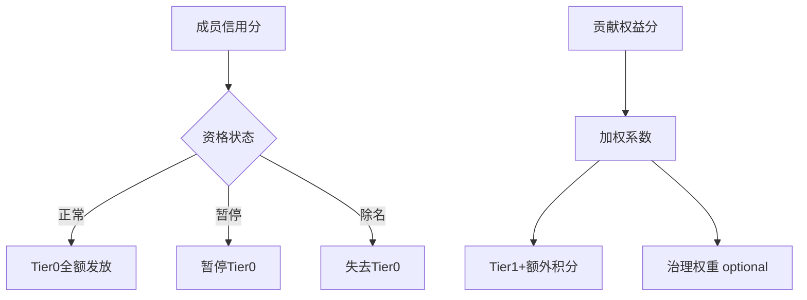
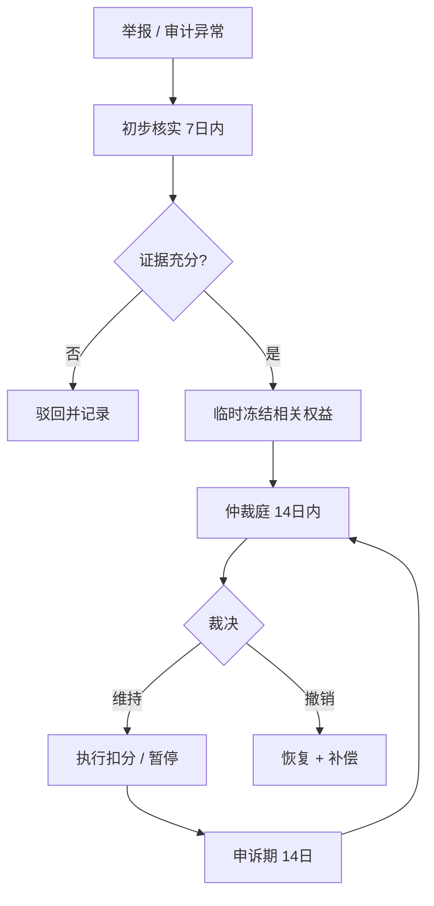

# 信义分规则草案 v0.1

> 状态：草案 · 非执行  
> 依据：[P0 机制决议](../decisions/2026-06-13-p0-mechanism-resolutions.md) §4、§5

## 1. 双分制定义

对外统称「信义分」，内部分拆：

| 分数 | 范围 | 用途 |
|------|------|------|
| **成员信用分** | 0–1000（示例） | 成员资格、Tier 0 风控 |
| **贡献权益分** | 0–无硬顶（加权有顶） | Tier 1+ 分配、治理权重 |

两分数**独立计算、独立展示**，避免「一个分数定生死」。

---

## 2. 成员信用分

### 2.1 初始与增长

| 事件 | 分值变化 |
|------|----------|
| 实名 + 不作恶承诺 | 初始 100 |
| 每连续 12 个月无违规 | +10（上限 200 基础信用奖励分） |

信用分**不**因贡献多寡增减。

### 2.2 扣分（仅事后、仲裁确认）

| 行为 | 扣分 | 其他 |
|------|------|------|
| 虚假申领 | -50 ~ -200 | 暂停 Tier 0，追回 |
| 倒卖集体物资 | -100 ~ -300 | 暂停 + 赔偿 |
| 传播虚假信息致信任损害 | -30 ~ -100 | 暂停部分权益 |
| 严重损害集体 | -200 ~ 除名 | 视情节 |

### 2.3 恢复

- 申诉成功：恢复扣分 + 补发暂停期间的 Tier 0
- 完成赔偿 + 6 个月无新违规：可申请恢复部分信用分

---

## 3. 贡献权益分

### 3.1 加分来源

| 来源 | 分值 | 说明 |
|------|------|------|
| **会员费按时缴纳** | +5 / 月 | 稳定参与贡献；计入 Tier 1+ |
| 连续 12 个月按时缴纳 | +10 一次性 | 稳定参与奖励 |
| 劳动贡献 | +2 ~ +10 / 次 | 仓储、配送、组织等 |
| 知识贡献 | +5 ~ +15 / 次 | 医疗 / 法律 / 技能咨询 |
| 物资捐赠 | 按价值折算 | 公开估值规则 |
| 治理参与 | +5 ~ +20 / 周期 | 审计、仲裁、规则修订 |
| AI 协作 | +3 ~ +10 / 次 | 标注、审核、任务定义 |

### 3.2 不加分的场景

- 超额缴纳会员费（不鼓励「花钱买分」）
- 仅因私人关系获得的非可验证贡献

### 3.3 衰减

| 条件 | 处理 |
|------|------|
| 连续 6 个月零贡献且未缴会员费 | -2 / 月 |
| 衰减下限 | 不低于初始贡献权益分（0 或首次加分前的值） |

衰减**不影响** Tier 0 资格与发放。

---

## 4. 权益挂钩



### 4.1 Tier 1+ 积分计算（示例）

```
Tier1_bonus = Tier0_baseline × min(contrib_weight, 0.30)
contrib_weight = member_contrib / community_median_contrib × 0.10
（contrib_weight 上限 0.30，即总权益 ≤ Tier0 × 1.3）
```

---

## 5. 不作恶清单

完整清单见 [P0 决议 §4](../decisions/2026-06-13-p0-mechanism-resolutions.md#4-不作恶底线清单)。

扣分**仅**适用于清单内「属于作恶」的行为。

---

## 6. 争议处理



---

## 7. 公开披露

- 加分 / 扣分标准全文公开
- 每月公布聚合统计：平均信用分、贡献分分布
- 惩罚案例脱敏公开：行为类型、规则条款、裁决结果
