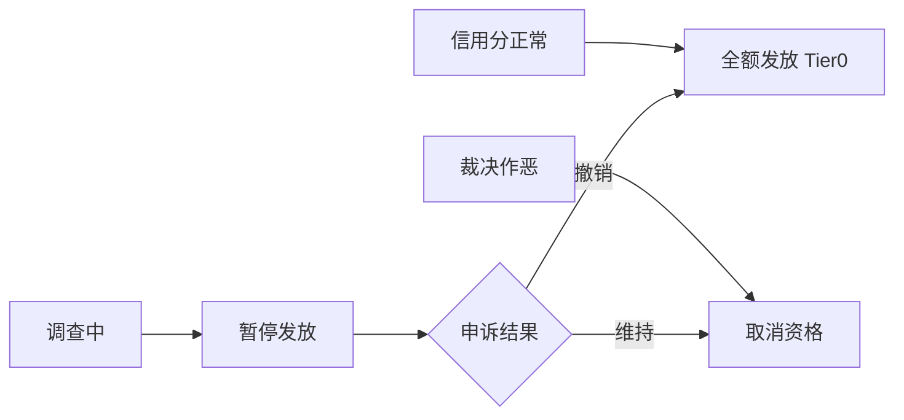

# Tier 0 规则草案 v0.1

> 状态：草案 · 非执行  
> 依据：[P0 机制决议](../decisions/2026-06-13-p0-mechanism-resolutions.md) §2

## 1. 目的

Tier 0 回答一个问题：**基本生活会不会塌？**

规则气质是托底，不是配给审判。合格成员定期领取接近均等的积分，用于兑换核心必需清单品类。

---

## 2. 成员资格

### 2.1 获得 Tier 0 资格

| 条件 | 说明 |
|------|------|
| 实名认证 | 建立责任链；具体粒度试点时定 |
| 签署不作恶承诺 | 知晓底线清单 |
| 完成观察期 | 建议 1 个月；观察期内可领 50% Tier 0 积分 |
| 成员信用分正常 | 无暂停 / 除名状态 |

### 2.2 不影响 Tier 0 资格的因素

- 会员费是否缴纳（不影响 Tier 0，仅影响 Tier 1 贡献权益分）
- 贡献权益分高低
- 劳动参与多少
- 失业、疾病、收入下降

### 2.3 失去 Tier 0 资格

仅以下情形，且经仲裁庭确认、申诉期结束：

1. 欺诈申领、重复申领
2. 挪用 / 破坏 / 倒卖集体物资
3. 严重损害集体利益且未恢复

---

## 3. 发放规则

| 项目 | 规则 |
|------|------|
| 周期 | 每月 1 次 |
| 发放日 | 固定日期（建议每月 1 日） |
| 额度 | 合格成员接近均等 |
| 差距上限 | 最高 / 最低 ≤ 1.5 倍 |
| 观察期折算 | 观察期成员 = 全额 × 50% |
| 暂停 | 调查期间暂停发放；裁决撤销则补发 |

### 3.1 差距上限的合法差异来源

| 因素 | 是否允许造成差异 |
|------|-----------------|
| 观察期 vs 满资格 | 是（50% vs 100%） |
| 地域物价系数 | 是（试点社区统一系数，非个人定制） |
| 会员费多少 | **否** |
| 贡献权益分 | **否** |
| 信用分（非暂停） | **否** |

---

## 4. 积分用途

- 仅可兑换 [核心必需清单](../decisions/2026-06-13-p0-mechanism-resolutions.md#1-必需品边界)
- 不可转让、不可变现
- 未使用积分可结转 1 个周期，第 2 周期未使用则回流池子（试点可调）
- 兑换请求优先于外销排产

---

## 5. 信用分与 Tier 0

成员信用分**仅做风控**：

信用分高低**不**改变 Tier 0 额度。

---

## 6. 会员费关系

| 场景 | Tier 0 | Tier 1+ |
|------|--------|---------|
| 按时缴纳会员费 | 正常发放 | +5 贡献权益分 / 月 |
| 未缴会员费 | 正常发放 | 不加分；连续 6 月则贡献分衰减 |

**原则**：Tier 0 不是付费会员制。减免 / 缓缴 / 劳动替代通道暂不考虑。

---

## 7. 公开披露

每月公开（脱敏）：

- Tier 0 发放总额、人均积分
- 合格成员数、暂停数、恢复数
- 核心必需兑换履约率
- 最高 / 最低额度比（应 ≤ 1.5）

---

## 8. 试点参数（示例）

| 参数 | 示例值 |
|------|--------|
| 观察期 | 1 个月 |
| 满资格 Tier 0 积分 | 100 分 / 月 |
| 观察期 Tier 0 积分 | 50 分 / 月 |
| 100 分可兑换 | 5 kg 大米 + 0.5 L 食用油（见 MVP 附录） |

数值仅供推演与讨论，试点前须重新校准。
