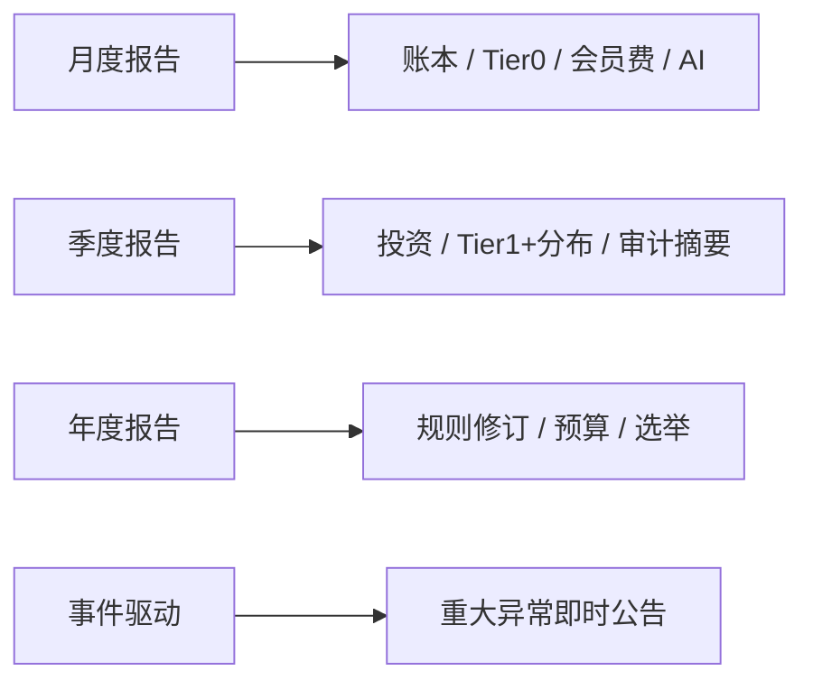

# 透明治理草案 v0.1

> 状态：草案 · 非执行  
> 依据：[P0 机制决议](../decisions/2026-06-13-p0-mechanism-resolutions.md)、[治理与风险](../design/governance-and-risks.md)

## 1. 原则

- 规则、账本、资金流向、投资标的、分配结果、惩罚案例**原则上公开**
- 个人隐私须脱敏，但不得以隐私为名隐藏系统性风险
- 披露有固定节律，异常事项及时补充披露

---

## 2. 信息公开目录

### 2.1 必须完整公开

| 类别 | 内容 | 频率 |
|------|------|------|
| 规则 | 章程、信义分标准、Tier 0/1+ 规则、不作恶清单 | 修订即公开 |
| 账本 | 资金流入 / 流出、余额、专户 | 每月 |
| 会员费 | 收缴率 | 每月 |
| Tier 0 | 发放总额、人均、履约率、最高最低比 | 每月 |
| Tier 1+ | 分配总额、加权分布、前 10% 占比 | 每季度 |
| 风险准备金 | 余额、最低水位、覆盖率 | 每月 |
| 投资 | 标的、金额、理由、收益 | 每季度 |
| 惩罚案例 | 行为类型、规则、裁决（脱敏） | 每案 |
| AI | 使用范围、产出、成本、异常 | 每月 |

### 2.2 脱敏后公开

| 类别 | 公开内容 | 不公开 |
|------|----------|--------|
| 成员 | 聚合统计、匿名案例 | 真名、住址、联系方式 |
| 健康 | 报销类别统计 | 具体病历 |
| 争议 | 行为描述 + 裁决 | 当事人身份 |

### 2.3 实时 / 及时披露

- 单笔超过池子 5% 的支出
- 投资失败或重大亏损
- 资金异常、审计发现问题
- AI 产出异常或伦理事件

---

## 3. 披露节律

---

## 4. 治理机构（Phase 1 最小集）

| 机构 | 职责 | 轮换 |
|------|------|------|
| 成员代表大会 | 规则修订、预算、选举 | 每年 |
| 理事会 | 日常执行 | 2 年 |
| 资金管理小组 | 专户、收支、披露 | 1 年 |
| 信义分仲裁庭 | 争议、扣分、申诉 | 1 年，避嫌 |

Phase 1 可不设 AI 监督小组（无复杂 AI 时），但须在规则中预留。

---

## 5. 决策流程

| 类型 | 流程 | 通过门槛 |
|------|------|----------|
| 日常运营 | 理事会执行 | — |
| 一般事项 | 公示 7 天 → 理事会 | 简单多数 |
| 重大事项 | 公示 14 天 → 成员投票 | 2/3 多数 |

**重大事项**：章程修改、核心必需清单变更、年度预算、信用分规则大改、风险准备金水位调整。

---

## 6. 异议通道

- 任何成员可在公示期内提交书面 dissent
- dissent 须登记、公开计数，不得静默
- 未改变结果时，须公开「未采纳理由」

---

## 7. 隐私与脱敏规范

| 原则 | 说明 |
|------|------|
| 最小必要 | 只收集运行所需数据 |
| 用途限定 | 成员数据不用于对外 AI 训练（除非明示同意） |
| 脱敏标准 | 惩罚案例用「成员 A」+ 行为类型 |
| 审计例外 | 审计员可访问完整账，须签保密义务 |

---

## 8. Phase 1 最小披露模板

### 月度报告目录

1. 池子余额与本月收支摘要
2. 会员费收缴率
3. Tier 0 发放与兑换履约
4. 风险准备金水位
5. 本月争议与裁决摘要
6. AI 使用与成本（若有）
