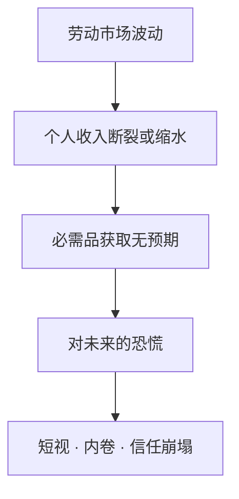
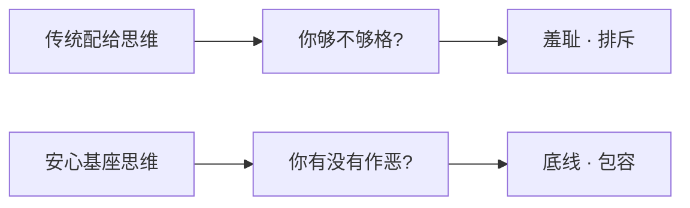
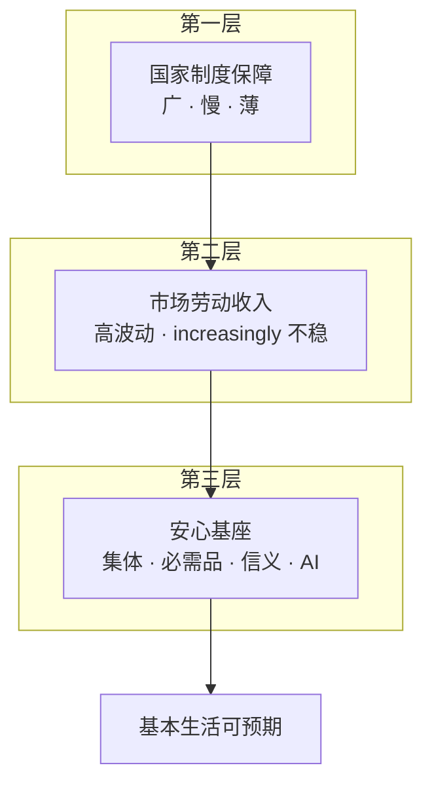
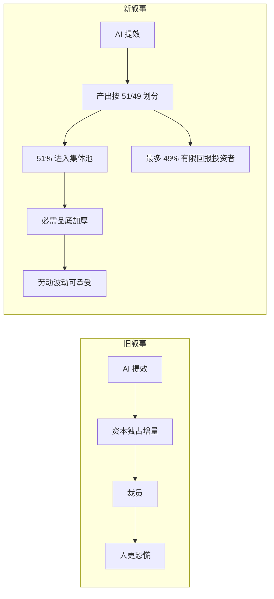

# 哲学基础

> 阶段：**开放概念** — 先回答「为什么」和「是什么」，暂不谈「怎么落地」。

## 1. 我们在回应什么问题

### 1.1 表面问题

很多人对未来恐慌：怕失业、怕被 AI 替代、怕收入不稳、怕一直穷。

### 1.2 深层问题

这些恐惧指向同一个结构：**人的生存太绑定在「即时劳动 — 即时交换」上**。

一旦劳动这条线抖动——被裁、被算法替换、行业周期、健康下滑——人就会感到**存在性不安**：不是「少买一件商品」，而是「下一餐、下一针药、下一间屋有没有着落」。

安心基座要回应的，是这种**与劳动市场脱钩的生存不确定性**。

---

## 2. 核心主张

> **保障不必等于富裕；可预期的基本生活，本身就能大幅降低恐慌。**

系统追求的不是让每个人变富，而是：

1. **托底**：生活必需品有 collective 层面的着落
2. **可预期**：成员知道「不作恶，就有一条底线在」
3. **可参与**：愿意贡献的人，底可以更厚
4. **可共享**：AI 带来的生产力增量，至少 51% 进入集体池，而非完全归少数所有者

---

## 3. 第一性原理

| 原理 | 含义 |
|------|------|
| **必需品优先** | 先保障活得起、病得起、住得下去，再谈发展 |
| **宽松准入** | 不设道德高线，只设行为底线；不作恶即可存续 |
| **贡献增益** | 多贡献者多受益，避免无差别均分导致贡献意愿下降 |
| **集体受益** | 成员是资产的共同受益人，不是被施舍的客体 |
| **集体控股** | 至少 51% 属于集体，最多 49% 可归投资者，资本参与但不控制方向 |
| **AI 为池** | AI 增值优先进入集体池，而非只进入股东口袋 |
| **透明可申诉** | 权力必须可见、可质疑、可纠正 |

---

## 4. 「宽松」的哲学含义

「宽松」不是管理松懈，而是一种**对人的基本信任**：

- 默认你是共同体的一员，除非你**主动伤害**这个共同体
- 不审查你的信仰、消费、生活方式、是否「足够努力」
- 允许失败、低谷、沉默期——不因一次失业或生病就除名

这与传统「福利羞耻」「道德配给」相对立。系统的气质应是**托底**，而非**整肃**。

---

## 5. 为什么叫「信义分」而不是「道德分」

| 词 | 隐含语义 | 问题 |
|----|---------|------|
| 道德分 | 你在道德上好不好 | 易滑向审判、标签、意识形态 |
| 信义分 | 你是否值得在这个池子里互信共存 | 聚焦**关系与边界**，而非人格等级 |

信义分回答的问题不是「你是好人吗」，而是：

- 你是否在实名边界内活动？
- 你是否遵守「不作恶」的底线？
- 你是否为池子做过可识别的贡献？

**分数是参与权重，不是灵魂评分。**

---

## 6. 「不作恶」的哲学边界

「不作恶」是**最低共识**，不是最高理想。

### 6.1 包含什么

- 不欺诈集体、不恶意占资源
- 不损害其他成员的基本生存权
- 不做明显违法、蓄意伤人的行为

### 6.2 不包含什么

- 不要求利他、不要求奉献、不要求意识形态一致
- 不惩罚「躺平」「低欲望」「不参与贡献」
- 不把私人道德（性、酒、游戏、消费）纳入评分

**哲学立场**：人不必「有用」才配活着；但在一个共享池子里，人至少不能**主动破坏**这个池子。

---

## 7. 集体与个人：我们不是什么

### 7.1 不是慈善

慈善是「我有余，分你一点」，权力在施予者。  
安心基座是「我们共建一个池，人人是受益人」，权力结构应扁平、可审计。

### 7.2 不是传统征信

征信服务商业借贷；信义分服务**共同体成员资格与权益权重**，二者不应混用。

### 7.3 不是国家替代

国家社保追求广覆盖；本系统追求**可感知的、社区/集体尺度的、与必需品绑定的底**。二者互补。

### 7.4 不是平均主义

系统不做**全体无差别均分**，但 **Tier 0** 成员**定期领取**、接近均等的生存底线积分；**Tier 1+ 增量**才按贡献权益分加权。贡献多者在 Tier 1+ 额度更高；只是系统不因低谷、失业、生病而轻易把人完全排除出 Tier 0。

### 7.5 不是 AI 乌托邦

不说「AI 养活全人类」，而说 **AI 为系统工作，51% 进入集体池，集体再托人**—— realistic、可讨论、可渐进。

---

## 8. 第三层安全网

第三层的独特之处：

- **物质锚定**：投必需品，而非抽象金融幻想
- **关系锚定**：信义分建立「谁在这个池子里」的边界
- **技术锚定**：AI 作为集体生产力，而非 purely 失业源

---

## 9. AI 养人的哲学

### 9.1 问题背景

AI 时代的主要叙事是：**机器拿走岗位，人失去议价权**。恐慌因此加剧。

### 9.2 叙事翻转

安心基座提出另一种分配想象：

关键不在「AI 不替代人」，而在于 **替代之后产出的归属与控制权**。投资者可以获得回报，但集体必须保有 51% 的收益池和方向控制权。

### 9.3 人的位置

人并未退出系统，而是转向：

- **定义目标**：什么该做、什么不该做
- **监督 AI**：敏感决策 human-in-the-loop
- **补充 AI 不能做的**：本地关系、身体劳动、伦理判断
- **共享结果**：即使不直接操作 AI，仍享基础保障

**AI 干活，人享其成**——不是让人退出劳动市场，而是让人**少依赖单一雇主**来活。

---

## 10. 恐慌为何能被降低

恐慌来自**不可预期**。降低恐慌需要可预期，而非 necessarily 更多钱。

| 机制 | 如何作用于心理 |
|------|---------------|
| 必需品底 | 「至少不会饿死 / 无药可看」变得可想象 |
| 信义分保底 | 「我不作恶，资格就在」——关系可预期 |
| 集体透明 | 「池子有没有、规则公不公平」可验证 |
| AI 造血 | 「池子还在长大，不是只消耗」——希望可预期 |

这不是说焦虑会消失，而是把**存在性恐慌**降级为**可改善的生活压力**。

---

## 11. 与相关思想的对话

| 传统 / 思潮 | 关系 |
|------------|------|
| 互助共济 | 近亲；安心基座更强调必需品资产化 + AI |
| 合作社 | 可借鉴组织形式；我们更强调「底」与信义 |
| UBI（全民基本收入） | 精神相近；我们多了集体池、信用与贡献加权、必需品锚定 |
| 共产主义理想 | 共享产出的回声；我们刻意保持开放、渐进、非强制 |
| 公司福利 | 雇主绑定；我们是跨雇主的第三层 |
| Web3 / DAO | 可借鉴透明与治理；我们暂不预设链上实现 |

安心基座是**实用主义的安全网哲学**：不等待完美革命，先定义一条可讨论的底。

---

## 12. 一句话

**人不必完美才配被托住；集体不必等到富裕才该开始共担必需品；AI 不必只让人失业，也可以为池子工作。**
