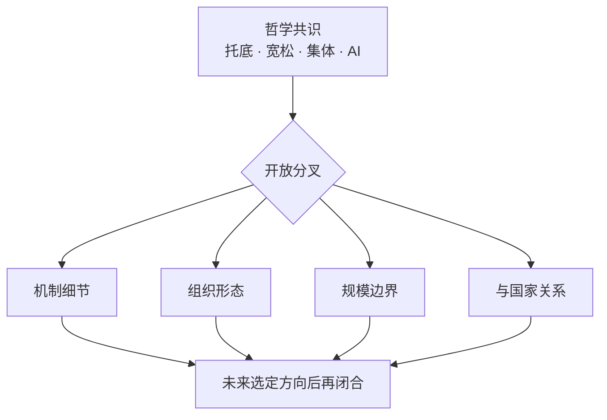

# 张力与开放问题

> 概念阶段 deliberately 保留未决问题。强行过早闭合，会损害系统的诚实性与可演化性。

## 1. 为什么保留开放

安心基座目前处于 **方向 D：开放概念**。下列张力没有标准答案；文档的作用是**标出分叉点**，供后续讨论、辩论、小规模验证时再取舍。

---

## 2. 核心张力

### 2.1 宽松 vs 防滥用

| 极 | 风险 |
|----|------|
| 过松 | 搭便车、欺诈、池子被掏空 |
| 过紧 | 道德审判、排斥、回到「配给羞耻」 |

**开放问题**：基础额度应低到「仅生存」，还是略高到「有尊严」？低多少才不算羞辱？

---

### 2.2 实名 vs 隐私

实名建立责任链，但也带来 surveillance 恐惧。

**开放问题**：

- 实名粒度：真名 / 化名 + 可验证身份 / 零知识证明？
- 谁可见谁的数据：全员 / 审计员 / 仅聚合统计？

---

### 2.3 信义分 vs 平等尊严

贡献多者额度更高，与「人不需有用才配活」是否冲突？

**开放问题**：

- Tier 1+ 加成上限应设多高，才不算「新阶级」？
- Tier 0「接近均等」的差距上限（如 1.5 倍）是否足够？
- 如何避免「信义分低 = 人格低」的社会标签化？

**决议草案**（2026-06-13）：见 [P0 机制决议 §2–3](../decisions/2026-06-13-p0-mechanism-resolutions.md)。Tier 0 差距 ≤ 1.5 倍；Tier 1+ 单周期加成 ≤ Tier 0 × 30%；信用分与贡献分分离展示。

---

### 2.4 集体 vs 个人自由

入池意味着部分资源集体决策；退出权如何保障？

**开放问题**：

- 退出时，个人捐赠是否可退、可部分退、不可退（像会费）？
- 集体对必需品投资的方向，少数 dissent 如何处理？

---

### 2.5 必需品边界

何谓「必需」？因文化、地域、时代而异。

**开放问题**：

- 手机算必需吗？网络呢？心理健康服务呢？
- 清单由谁定、多久修订、如何避免「必需」膨胀拖垮池子？

**决议草案**（2026-06-13）：见 [P0 机制决议 §1](../decisions/2026-06-13-p0-mechanism-resolutions.md)。三层清单（核心 / 扩展 / 非必需）；心理健康服务暂搁置。

---

### 2.6 AI 养人 vs 劳动尊严

若 AI 承担越来越多生产，人的「价值感」从哪来？

**开放问题**：

- 系统是否应 explicit 保留「人的劳动机会」（如社区服务岗）？
- 「不劳动也有底」会不会削弱共同体参与意愿？
- 如何避免 AI 监督本身变成新的权力中心？

**当前倾向**：

> AI 产出按至少 51% 集体 / 最多 49% 投资者有限收益划分。集体部分 Tier 0 接近均等，Tier 1+ 按贡献加权，使参与 AI 协作、监督、任务定义的人获得更高增量权重。

---

### 2.7 集体控制 vs 投资者激励

没有投资者，系统可能难以冷启动和扩大资产；投资者权力过大，系统又会被收益最大化逻辑吞掉。

**开放问题**：

- 至少 51% 集体控制权如何落实到章程、协议、投票权和资产权？
- 最多 49% 投资者有限收益是否有上限、锁定期或退出规则？
- 如何防止投资者通过债权、优先清算、董事席位等方式实际控制系统？

**当前倾向**：

> 资本可以参与收益，但不能支配保障原则。至少 51% 不只是收益份额，更是系统方向控制权；最多 49% 应是有限回报，而非永久抽水。

---

### 2.8 保障激励 vs 逆向选择 / 道德风险

保障太弱，无法降低恐慌；保障太强，可能吸引高风险低贡献者，并削弱贡献意愿。

**开放问题**：

- 新成员是否应有观察期 / 等待期？
- 最低保障应低到什么程度，才能托底但不替代劳动？
- 高成本项目（医疗、住房、长期照护）是否需要限额、共付比例、复核机制？
- 风险准备金最低水位应覆盖几个月支出？

**当前倾向**：

> Tier 0 低而稳且接近均等；Tier 1+ 完整权益逐步释放；更高额度来自贡献权益分；高成本项目必须有共付、限额或复核；风险准备金优先于大规模 Tier 1+ 分配。

---

### 2.9 规模 vs 信任

小社区靠 face-to-face 信任；大规模需要制度与技术。

**开放问题**：

- 安心基座天然上限是多少？100 / 1 万 / 100 万？
- 跨社区联盟时，信义分是否互认？
- 何时从「熟人伦理」切换到「陌生人制度」？

---

### 2.10 农业 / 基础工业优先 vs 资产多元化

资金优先投向农业与基础工业，可以增强底层供给能力；但过度集中也可能带来行业周期、地域和经营风险。

**开放问题**：

- 农业、能源、材料、基础制造的边界如何定义？
- 金融型资产只能作为现金管理和风险准备，还是可以承担部分抗通胀功能？
- 若某些基础工业项目收益低但战略价值高，如何定价？

**当前倾向**：

> 资金以农业 / 基础工业为主，金融型资产为辅。优先追求底层供给能力，而非最高收益率。

---

### 2.11 公开透明 vs 个人隐私

系统必须公开透明，否则会退化为黑箱互助会；但实名系统也涉及个人隐私和安全。

**开放问题**：

- 哪些信息必须完整公开，哪些只公开脱敏版本？
- 信用惩罚案例公开到什么粒度，既能形成规则可信度，又不变成羞辱？
- 投资失败、资金异常、AI 产出异常是否必须实时公开？
- 农业 / 基础工业的全流程、关键技术、检验检疫、质量追溯、环境影响应公开到什么粒度？

**当前倾向**：

> 规则、账本、资金流向、投资标的、收益分配、信用惩罚案例、绿色安全流程、检验检疫与质量追溯原则上公开；个人身份、健康、家庭等敏感信息可脱敏。

---

### 2.12 成员积分兑换 vs 外销增长

成员通过 **积分** 换取集体产品与服务，系统对有效兑换 **优先履约**。同时，农业 / 基础工业产品须面向集体外销售，为系统引入增量——外销不是为了与成员抢货，而是为了让整体经济增长；若只有向内兑换消耗、没有外销带来的增长，池子会被兑空。

**张力**：

- 外销价高于成员积分兑换价时，运营上是否仍坚持成员兑换优先排产？
- 「不能只消耗没增长」如何量化——外销占比、净增量、风险准备金水位各设多少？
- 积分发放节奏与外销现金流是否匹配，会否出现「有积分无货」？

**开放问题**：

- 积分与贡献权益分、保障池额度的换算规则如何设计？
- 外销占可售产出、积分兑换占可售产出的建议比例如何按社区规模调整？
- 外销增量 / 积分兑换消耗的滚动平衡周期多长？
- 对外销售价格、毛利、销售对象和收益流向公开到什么程度？
- 绿色安全品牌带来的溢价应如何在成员兑换价、集体池、投资者之间分配？

**当前倾向**：

> 成员用积分换取，优先提供；外销为系统整体增长服务，不能只向内消耗而没有增量。二者通过「兑换优先履约 + 增长平衡监控」共存，而非简单的配额切分。

---

### 2.13 事后道德追责 vs 道德泛化

信用分惩罚需要基于道德底线和是否损害集体利益，但「道德」很容易被泛化成生活方式审判。

**开放问题**：

- 如何定义「损害集体利益」？
- 未造成实际损害但存在明显恶意的行为是否处理？
- 事后追责如何避免演变成舆论审判？

**决议草案**（2026-06-13）：见 [P0 机制决议 §4](../decisions/2026-06-13-p0-mechanism-resolutions.md)。成文「作恶 / 非作恶」双清单；惩罚须事后、可申诉、可恢复。

---

### 2.14 与国家的关系

互补还是竞争？政策化还是民间自治？

**开放问题**：

- 若国家推行类似 UBI，本系统还有必要吗？
- 会否被视作非法集资、非法吸收存款？
- 是否应争取「政策 sandbox」，还是刻意保持民间？

---

## 3. 机制层开放问题

| # | 问题 | 备注 |
|---|------|------|
| 1 | 信义分是否设上限 / 下限 / 衰减？ | 防固化 vs 防僵尸账户 |
| 2 | 无力捐赠者如何入池？ | **暂搁置** — 减免 / 缓缴 / 劳动替代通道暂不考虑；未缴会员费不影响 Tier 0，仅不计 Tier 1 |
| 3 | 扣分能否低于「基础资格线」？ | 即作恶者是否完全失去底 |
| 4 | AI 产出知识产权归谁？ | 池子 / 协作者 / 开源 |
| 5 | 51% 集体控制权如何防架空？ | 投资条款、债权、治理权都可能绕开比例 |
| 6 | 投资者 49% 是否设收益上限？ | 激励资本 vs 防止吸血 |
| 7 | 成员信用分和贡献权益分如何拆分？ | **决议草案** — 见 [P0 §5](../decisions/2026-06-13-p0-mechanism-resolutions.md#5-信用分与贡献权益分边界) |
| 8 | 如何防逆向选择？ | 观察期、等待期、权益逐步释放 |
| 9 | 如何防道德风险？ | 低而稳的底、高成本共付、异常复核 |
| 10 | 风险准备金最低水位是多少？ | 抗周期与信任稳定 |
| 11 | 农业 / 基础工业优先的边界是什么？ | 底层供给能力 vs 资产集中风险 |
| 12 | 绿色安全的最低透明标准是什么？ | 全流程、技术、检验检疫、质量追溯 |
| 13 | 积分兑换与外销增长如何平衡？ | 兑换优先履约 vs 不能只消耗没增长 |
| 14 | 信息公开目录如何定义？ | 透明治理 vs 隐私脱敏 |
| 15 | 信用分事后追责如何避免道德泛化？ | 道德底线 vs 生活方式审判 |
| 16 | 实物储备 vs 金融投资的最优 mix | 因社区而异，暂无普适公式 |
| 17 | 链上账本是否必要？ | 透明 vs 复杂度 vs 合规 |
| 18 | 冷启动：第一批成员从哪来？ | 信任种子 |
| 19 | 如何度量「恐慌下降」？ | 主观量表 vs 行为数据 |
| 20 | Tier 0 差距上限与 Tier 1+ 加权上限各设多少？ | **决议草案** — Tier0 ≤1.5 倍；Tier1+ ≤30% |
| 21 | 三期之间切换的触发条件是什么？ | 互助 → 生产 → 完整经济体 |

---

## 4. 故意不回答的问题（现阶段）

以下问题在概念未成熟前**不应过早定案**：

1. 具体法律主体形式
2. 具体会员费金额与 SKU 清单
3. 具体 AI 技术栈与 vendor
4. 是否 token 化、是否发币
5. MVP 时间表与试点城市

这些属于**实现层**；当前阶段讨论它们会分散对「底是什么、凭什么、边界在哪」的打磨。

---

## 5. 讨论优先级（建议）

概念阶段建议按此顺序闭合问题：

```mermaid
flowchart LR
    A[1 何谓必需] --> B[2 信用 / 贡献加权<br/>上限与最低入口]
    B --> C[3 不作恶底线清单]
    C --> D[4 有限资本回报]
    D --> E[5 农业 / 基础工业边界]
    E --> F[6 绿色安全标准]
    F --> G[7 积分兑换与外销增长]
    G --> H[8 公开透明与隐私]
    H --> I[9 事后道德追责]
    I --> J[10 逆向选择 / 道德风险]
    J --> K[11 AI 归属原则]
    K --> L[12 规模与信任模型]
    L --> M[13 实现方向选择]
```

前十一题偏哲学与机制；第十二题连接规模；第十三题才导向社区 / 产品 / 政策路径。

---

## 6. 如何参与打磨

每闭合一个开放问题，建议：

1. 在本文档对应条目下追加 **「决议草案」** 或 **「暂搁置」** 标记
2. 若涉及机制变更，同步更新 [机制总览](../design/mechanism-overview.md)
3. 若触及根本立场，回溯 [哲学基础](./foundations.md) 是否仍成立

**未写入文档的共识，不算共识。**
