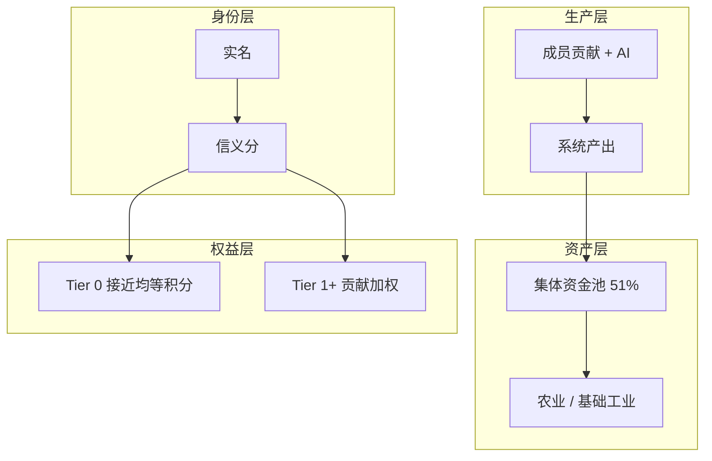
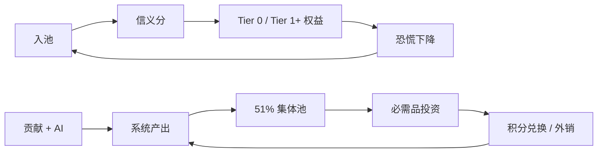

# 安心基座 · 系统设计总览

> 日期：2026-06-13 · 状态：**开放概念** — 暂不落地

一页纸全貌。深度见 [哲学基础](../philosophy/foundations.md)、[机制总览](../design/mechanism-overview.md)、[张力与开放问题](../philosophy/tensions-and-open-questions.md)。

## 1. 问题与命题

**痛点**：生活必需品没有底 — 劳动收入一旦断裂，基本生活不可预期。

**命题**：实名 + 信义分划界，51% 集体控股，绿色农业 / 基础工业为物质底，AI 造血，Tier 0 接近均等托底、Tier 1+ 按贡献加权，资本有限利，规则透明。

**宽松**：实名即可入池；不作恶即保留资格；不因失业 / 生病除名；可自由退出。

## 2. 四层架构

| 层 | 作用 |
|----|------|
| 身份 | 责任链 + 信义分（非道德审判） |
| 生产 | 人贡献 + AI 降本 / 造血 |
| 资产 | 必需品投资为主；外销引入增长 |
| 权益 | Tier 0 答「会不会塌」；Tier 1+ 答「多做有没有回报」 |

详见 [机制总览 §3.1](../design/mechanism-overview.md#31-保障分层tier-0--tier-1)。

## 3. 第三层安全网

国家社保（广而薄）→ 劳动收入（高波动）→ **安心基座**（集体 · 必需品 · 信义 · AI）→ 基本生活可预期。

## 4. 价值闭环

## 5. 三期路线

| 阶段 | 核心 | 不做 |
|------|------|------|
| Phase 1 互助基座 | Tier 0 + 透明账本 + 实物储备 | 重资产、51/49 |
| Phase 2 生产试点 | 单资产 + 外销 + 积分兑换 | 全国扩张 |
| Phase 3 完整经济体 | 51/49 + AI 造血 + Tier 1+ 完整 | Phase 1 全启动 |

详见 [机制总览 §10](../design/mechanism-overview.md#10-三期路线图)。[MVP](./design/mvp.md) 为 Phase 1 附录。

## 6. 当前状态

P0 五题已闭合 → [决议](../decisions/2026-06-13-p0-mechanism-resolutions.md) + [规则草案](../drafts/rules-v0.1.md) + [推演模型](./2026-06-13-simulation-model.md)。

**方向**：D → A 过渡 — 机制前置设计已完成，下一步是 300–500 人社区互助实验准备，不急于产品化或政策化。

**推演约束**：100 人不可独立可持续；会员费 → Tier 1 不破坏 Tier 0；Phase 1 AI ROI < 1 可接受。

**仍搁置**：法律主体、试点社区、章程定稿、MVP 时间表。

## 7. 相关文档

- 哲学：[哲学基础](../philosophy/foundations.md) · [张力与开放问题](../philosophy/tensions-and-open-questions.md)
- 机制：[机制总览](../design/mechanism-overview.md) · [所有权](../design/ownership-and-distribution.md) · [经济模型](../design/economic-model.md) · [信义分](../design/moral-score.md) · [集体资金](../design/collective-fund.md) · [AI 养人](../design/ai-productivity.md) · [治理](../design/governance-and-risks.md)
