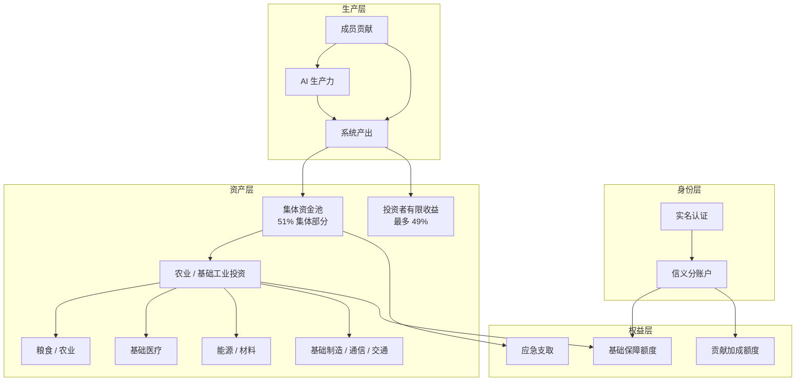
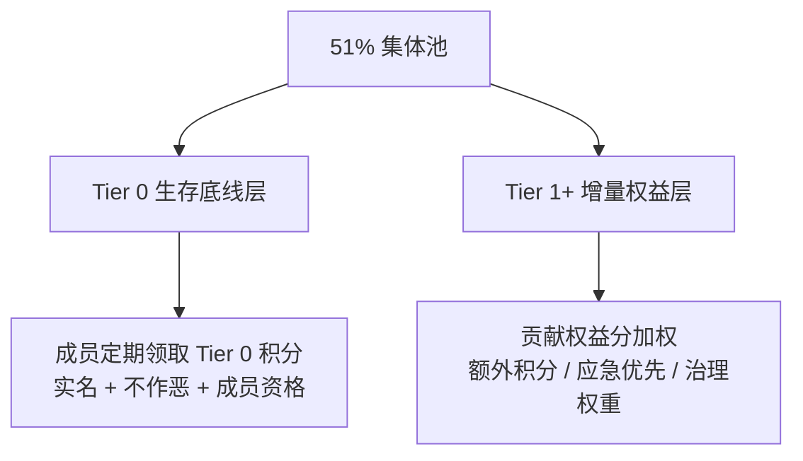
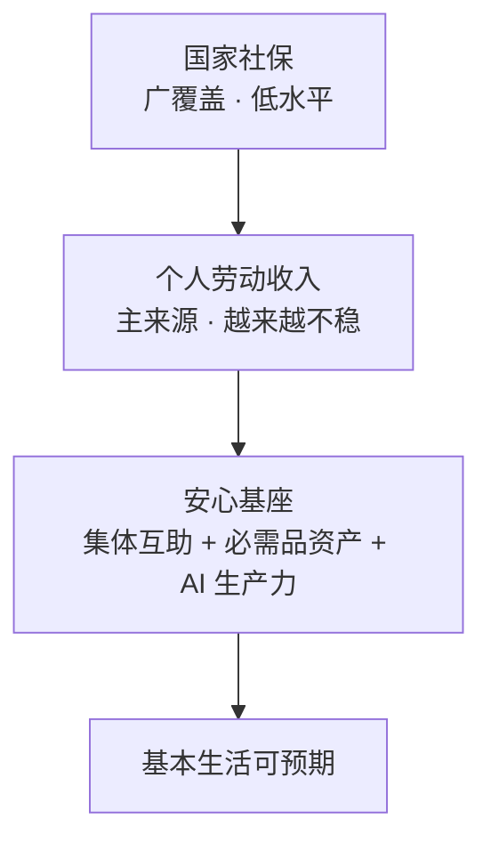
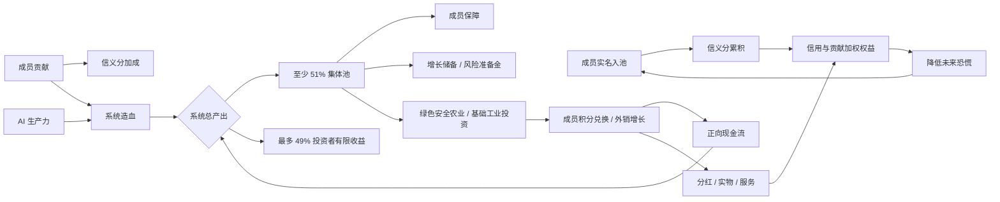

# 安心基座 · 系统设计总览

> 日期：2026-06-13  
> 状态：**开放概念** — 哲学与机制打磨中，暂不落地

本页是一页纸全貌。深度讨论见 [哲学基础](../philosophy/foundations.md)、[机制总览](../design/mechanism-overview.md)、[所有权与分配机制](../design/ownership-and-distribution.md)、[经济模型与激励设计](../design/economic-model.md)、[张力与开放问题](../philosophy/tensions-and-open-questions.md)。

## 1. 问题定义

### 1.1 核心痛点

对未来的恐慌，根源是**生活必需品没有底**——人无法预期「即使收入断了，基本生活也不会塌」。

### 1.2 恐慌来源与本质

| 恐慌来源 | 本质 |
|---------|------|
| 失业 | 劳动收入突然断裂 |
| 被 AI 替代 | 劳动价值被系统性压缩 |
| 收入不稳定 | 现金流不可预测 |
| 长期低收入 | 储蓄与抗风险能力弱 |

以上均可归结为：**缺少一条与劳动市场脱钩的、可预期的生存保障线**。

---

## 2. 核心命题

> 用**实名 + 信义分**建立信任边界，用 **至少 51% 集体 / 最多 49% 投资者** 的所有权结构守住集体控制权，用**集体资金优先投资绿色安全的农业与基础工业**建立物质底，用 **AI 生产力**为系统持续造血，并通过有限资本回报、风险准备金、贡献激励、产品对外销售和公开透明治理维持长期可持续，让成员在收入波动时仍能预期基本生活有保障。

### 2.1 「宽松」的含义

| 维度 | 做法 |
|------|------|
| 准入 | 实名即可，无学历、资产门槛 |
| 存续 | 不作恶即保留资格，不要求高贡献 |
| 退出 | 可自由退出，个人贡献部分可带走（若有约定） |
| 失败容忍 | 不因一次困境（失业、生病）除名 |

---

## 3. 系统命名

| 名称 | 含义 |
|------|------|
| **安心基座** | 强调托底，而非施舍 |
| **共需经济** | 共同满足必需需求 |
| **信义池** | 信义分 + 集体资金池 |

推荐对外名称：**安心基座**。

---

## 4. 三层架构

### 4.1 身份层

- **实名**：防滥用、建立责任链，非 surveillance
- **信义分**：参与资格与权益权重，非道德审判（详见 [信义分机制](../design/moral-score.md)）

### 4.2 生产层（新增）

- **成员贡献**：劳动、知识、物资、治理参与
- **AI 生产力**：为系统自动化运营、创造可分配价值（详见 [AI 养人](../design/ai-productivity.md)）
- 二者产出先形成系统总产出，再按至少 51% 集体池 / 最多 49% 投资者有限收益划分；直接服务成员的能力可作为集体权益的一部分

### 4.3 资产层

集体资金以**绿色安全的农业 / 基础工业**为主，目标是提高粮食、能源、基础材料、基础制造等底层供给能力，进而提高生活必需品获取能力。农业 / 基础工业资产要求全流程、关键技术、检验检疫和质量追溯公开透明，产品可对集体外用户销售形成正向收益（详见 [集体资金](../design/collective-fund.md)）。

### 4.4 权益层

成员是集体资产的**共同受益人**，而非被动受助者。分配拆成 **Tier 0 生存底线** 与 **Tier 1+ 增量权益** 两层（详见 [机制总览 §3.1](../design/mechanism-overview.md#31-保障分层tier-0--tier-1)）：

| 层级 | 作用 | 规则 |
|------|------|------|
| **Tier 0** | 回答「会不会塌」 | 成员**定期领取**接近均等的 Tier 0 积分，用于兑换必需品；成员信用分只做风控，不拉开 Tier 0 差距 |
| **Tier 1+** | 回答「多做有没有回报」 | 贡献权益分加权的额外积分；须有上限，避免新阶级 |

- **Tier 0 积分**：按周期（建议每月）发放；口粮、基础物资等直供型权益的主要载体，成员用积分兑换、优先履约
- **Tier 1+ 加成**：额外积分、应急通道优先、治理权重（若采用）
- **应急通道**：失业、疾病等条件下临时提高支取额度，可与 Tier 1+ 挂钩

信用分的风控 / 惩罚以**事后追责**为主，判断核心是是否违反基本道德底线、是否损害集体利益，而不是事前审查或生活方式评判。

---

## 5. 与现有体系的关系

本系统不取代市场或国家社保，而是**第三层安全网**：

---

## 6. 三种实现路径

### 方案 A：农业 / 基础工业分红型（最轻、最易启动）

集体资金购买农业、能源、基础材料、食品加工等资产 → 按信用与贡献权重分红或发券。

| | |
|---|---|
| 优点 | 法律结构相对清晰，启动成本低 |
| 缺点 | 市场波动时保障感可能打折 |

### 方案 B：实物储备型（保障感最强）

建立物理储备（粮、药、基础物资），按分领取。

| | |
|---|---|
| 优点 | 看得见摸得着，抗恐慌效果最好 |
| 缺点 | 仓储、损耗、地域限制大，扩张慢 |

### 方案 C：混合基座型（推荐）

**70% 农业 / 基础工业资产 + 20% 实物储备 + 10% 风险准备 / 应急互助池**

兼顾底层供给能力、抗通胀、即时保障感与突发风险，并预留 AI 产出注入通道。

---

## 7. 所有权、经济模型与价值闭环

系统总产出先按 **至少 51% / 最多 49%** 划分：

- **至少 51% 集体池**：Tier 0 成员保障、Tier 1+ 贡献加权、增长储备、风险准备金
- **最多 49% 投资者有限收益**：用于回报出资者、基础设施提供者和早期风险承担者，但应有期限、上限或递减机制

51% 不只是收益比例，也代表集体对系统方向和保障原则的控制权。资本可以参与收益，但不能支配保障原则，也不能永久抽走公共增量。

---

## 8. 可持续性直觉

假设 1000 人、每人会员费 100 元：

- 月池：10 万 → 年池：120 万
- 30% 投稳定必需品资产（约 5% 年化）→ 年收益约 1.8 万
- AI 生产力可额外创造数字服务、运营效率、自动化管理等增量

规模越大，单位保障成本越低；AI 边际成本递减，长期有利于「AI 养人」。

---

## 9. 三期路线图

机制不必同时全部启动。概念阶段按阶段递进，避免永远停在「开放概念」：

| 阶段 | 核心 | 刻意不做 |
|------|------|----------|
| **Phase 1 互助基座** | 互助 + 实物储备 + 透明账本 + **Tier 0** | 重资产、大资本、51/49 |
| **Phase 2 生产试点** | 一个绿色农业 / 基础工业资产 + 外销 + 积分兑换 | 全国扩张、多资产 |
| **Phase 3 完整经济体** | 51/49、AI 造血、多资产、**Tier 1+** 完整激励 | Phase 1 一次性启动全部机制 |

详见 [机制总览 §10 三期路线图](../design/mechanism-overview.md#10-三期路线图)。[MVP 试点方案](../design/mvp.md) 定位为 Phase 1 草案。

---

## 10. 当前工作重心

P0 机制问题已闭合为 [决议草案](../decisions/2026-06-13-p0-mechanism-resolutions.md)（2026-06-13）。下列问题状态：

| # | 问题 | 状态 |
|---|------|------|
| 1 | 「必需」的边界 | ✅ 决议草案 |
| 2 | Tier 0 差距上限 | ✅ 决议草案（≤ 1.5 倍） |
| 3 | Tier 1+ 加权上限 | ✅ 决议草案（≤ 30%） |
| 4 | 「不作恶」底线清单 | ✅ 决议草案 |
| 5 | 51% 集体控制权防架空 | ⏸ Phase 2/3 |
| 6 | 农业 / 基础工业边界 | ⏸ Phase 2 |
| 7 | 绿色安全最低标准 | ⏸ Phase 2 |
| 8 | 积分兑换与外销增长 | ⏸ Phase 2（Phase 1 草案见资金草案） |
| 9 | 信息公开与隐私 | ✅ 透明治理草案 |
| 10 | 信用分事后追责 | ✅ 决议草案 |
| 11 | 投资者 49% 回报封顶 | ⏸ Phase 3 |
| 12 | 逆向选择与道德风险 | 部分闭合（观察期、共付） |
| 13 | AI 归属与分配 | ✅ AI 边界草案 |
| 14 | 规模与信任模型 | ✅ 推演模型（建议 300–500 人试点） |

**方向决策**：D → A 过渡，见 [实现方向决策](./2026-06-13-direction-decision.md)。仍不推进落地、不定 MVP 时间表。

### 机制闭合产出

- [P0 机制决议](../decisions/2026-06-13-p0-mechanism-resolutions.md)
- [规则草案包](../drafts/tier0-rules-v0.1.md)
- [推演模型](./2026-06-13-simulation-model.md)
- [方向决策](./2026-06-13-direction-decision.md)

---

## 11. 相关文档

### 哲学层

- [哲学基础](../philosophy/foundations.md)
- [张力与开放问题](../philosophy/tensions-and-open-questions.md)

### 机制层

- [机制总览](../design/mechanism-overview.md)
- [所有权与分配机制](../design/ownership-and-distribution.md)
- [经济模型与激励设计](../design/economic-model.md)
- [信义分机制](../design/moral-score.md)
- [集体资金与必需品投资](../design/collective-fund.md)
- [AI 养人](../design/ai-productivity.md)
- [治理与风险](../design/governance-and-risks.md)

### 附录

- [MVP 试点方案](../design/mvp.md)（非当前重心）
