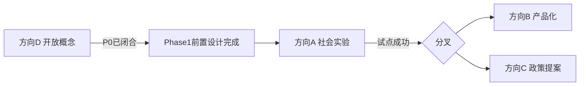

# 实现方向决策

> 日期：2026-06-13  
> 状态：建议稿  
> 依据：[P0 机制决议](../decisions/2026-06-13-p0-mechanism-resolutions.md)、[推演模型](./2026-06-13-simulation-model.md)

## 1. 决策背景

P0 机制问题已闭合为决议草案，五份规则草案与推演模型已完成。现对四个可能方向做评估与选择。

| 方向 | 含义 |
|------|------|
| **A** 社会实验 / 社区互助 | 小规模 Phase 1 试点 |
| **B** 可产品化平台 | 账本、规则引擎、成员门户 |
| **C** 政策 / 学术提案 | 白皮书、政策建议、研究框架 |
| **D** 继续开放概念 | 机制打磨，不推进落地 |

---

## 2. 评估矩阵

| 维度 | A 社会实验 | B 产品平台 | C 政策提案 | D 开放概念 |
|------|-----------|-----------|-----------|-----------|
| P0 闭合度 | 已足够启动前置设计 | 需更多数值验证 | 机制已够写白皮书 | 已闭合，继续微调 |
| 推演支撑 | 500 人可持续 | 1000 人更适合 ROI | 不依赖规模 | 不依赖 |
| 风险 | 合规、冷启动 | 过度工程化 | 政策窗口不确定 | 永远停在概念 |
| 与文档阶段一致 | 高（Phase 1 草案已有） | 中（偏 Phase 2+） | 中 | 高但缺进展 |
| 验证「恐慌下降」 | 直接 | 间接 | 间接 | 无法 |

---

## 3. 推演对决策的约束

[推演模型](./2026-06-13-simulation-model.md) 关键结论：

1. **100 人不可独立可持续** — 若选 A，目标规模应 300–500 人，或接受种子资助
2. **会员费 → Tier 1 不破坏 Tier 0** — 机制设计通过防阶级化检查
3. **AI Phase 1 ROI < 1 可接受** — 不应因 AI 未盈利而放弃 A
4. **Phase 2 外销需组合策略** — 选 A 时不应过早承诺单资产自给

---

## 4. 决策

### 推荐路径：**D → A 过渡**

**现阶段（2026-06）**：仍属 **D 的尾声**，但 P0 闭合与规则草案标志着 **可以开始 A 的前置准备**，而非立即执行试点。

**不建议现在选 B 或 C 作为主路径**：

- **B**：无真实用户数据，易过度设计；等 A 跑 6 个月再评估
- **C**：机制已够写摘要，但缺试点数据支撑政策说服力

---

## 5. 方向 A 前置条件检查

| 条件 | 状态 |
|------|------|
| Tier 0 规则草案 | ✅ [tier0-rules-v0.1](../drafts/tier0-rules-v0.1.md) |
| 信义分 / 不作恶清单 | ✅ [moral-score-rules-v0.1](../drafts/moral-score-rules-v0.1.md) |
| 透明治理草案 | ✅ [transparency-governance-v0.1](../drafts/transparency-governance-v0.1.md) |
| 会员费与资金规则 | ✅ [funding-growth-v0.1](../drafts/funding-growth-v0.1.md) |
| AI 边界 | ✅ [ai-usage-boundaries-v0.1](../drafts/ai-usage-boundaries-v0.1.md) |
| 规模推演 | ✅ [simulation-model](./2026-06-13-simulation-model.md) |
| 法律主体 | ⏸ 暂搁置 |
| 试点社区 | ⏸ 未选定 |
| 章程 v0.1 定稿 | ⏸ 草案已有，待审议 |
| MVP 时间表 | ⏸ 刻意不定 |

**结论**：机制层前置设计 **已完成**；组织层与合规层 **刻意未定**，符合文档阶段定位。

---

## 6. 若进入 A 的下一步（非现在执行）

1. 选定试点社区画像（300–500 人、有信任种子）
2. 章程 v0.1 成员审议 → 定稿
3. 法律咨询（合作社 / 互助协会 / 基金会）
4. 最小验证栈：公开 spreadsheet 账本 + 1–2 AI 能力（不必 App）
5. 6–12 个月运行 → 按 [MVP 复盘决策树](../design/mvp.md#10-复盘决策树) 评估

---

## 7. 方向 B / C 触发条件

| 方向 | 触发条件 |
|------|----------|
| **B 产品化** | A 试点留存 > 70%、池子可持续、恐慌指数下降 |
| **C 政策提案** | A 或 B 产生可引用数据 + 明确政策缺口 |

---

## 8. 一句话决策

**P0 机制闭合后，默认从 D 过渡到 A：先做 300–500 人社区互助实验的前置准备，不急于产品化或政策化；会员费增加 Tier 1 贡献分、Tier 0 保持均等的结构在推演中通过验证。**
