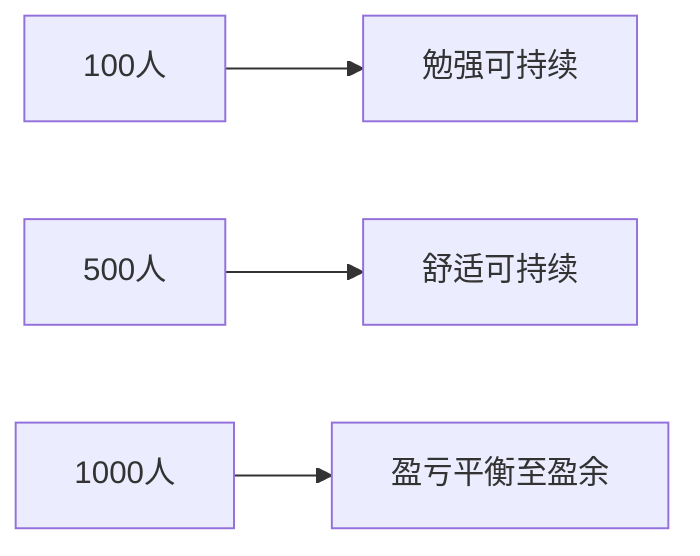

# 安心基座概念验证推演模型

> 日期：2026-06-13  
> 状态：推演草案 · 非财务承诺  
> 依据：[P0 机制决议](../decisions/2026-06-13-p0-mechanism-resolutions.md)、[规则草案 v0.1](../drafts/rules-v0.1.md#3-会员费与资金)

## 1. 推演目的

在不启动真实 MVP 的前提下，用三档规模（100 / 500 / 1000 人）检验：

- 「底线不厚但可持续」是否成立
- 会员费 → Tier 1 贡献分 → Tier 1+ 分配是否合理
- 风险准备金水位是否足够
- AI 降本能否改善单位保障成本

---

## 2. 统一假设

| 参数 | 值 | 说明 |
|------|-----|------|
| 会员费中位数 | 100 元 / 月 | 区间 50–200，取中位 |
| 收缴率 | 85% | 试点保守估计 |
| Tier 0 积分 | 100 分 / 月 | 满资格成员 |
| Tier 0 兑换成本 | 80 元 / 人 / 月 | 5 kg 大米 + 0.5 L 油 + 运维分摊 |
| 运维成本 | 5000 元 / 月 固定 + 2 元 / 人 | 人力、场地、系统 |
| AI 成本 | 运维预算 8% | Phase 1 轻量 |
| Tier 1+ 上限 | Tier 0 × 30% | 单成员额外积分上限 |
| 风险准备金目标 | 3 个月支出 | 见资金草案 |

### 2.1 池子分配（Phase 1 简化）

会员费流入按以下比例分配（月度）：

| 用途 | 比例 |
|------|------|
| Tier 0 兑换成本 | 45% |
| 实物储备补充 | 15% |
| 应急互助池 | 10% |
| 运维 + AI | 15% |
| 风险准备金 | 15% |

---

## 3. 三档规模推演

### 3.1 100 人社区

| 指标 | 计算 | 结果 |
|------|------|------|
| 月会员费流入 | 100 × 100 × 85% | **8,500 元** |
| 年流入 | × 12 | **102,000 元** |
| Tier 0 月支出 | 100 × 80 | 8,000 元 |
| 运维 + AI | 5000 + 200 + 680 | 5,880 元 |
| 月总支出（Tier0+运维） | | **13,880 元** |
| **月缺口** | 8500 - 13880 | **-5,380 元** |

**结论（100 人）**：纯会员费无法覆盖 Tier 0 + 运维，**不可持续**。需要以下之一：

- 降低 Tier 0 实物成本（如 60 元 / 人）
- 提高收缴率或中位数会员费
- 缩减运维（志愿者为主）
- 接受前 6–12 个月外部种子资助

**调整后（志愿者运维 + Tier 0 成本 60 元）**：

| 指标 | 结果 |
|------|------|
| Tier 0 月支出 | 6,000 元 |
| 运维 + AI | 1,500 元（志愿者） |
| 月总支出 | 7,500 元 |
| 月缺口 | +1,000 元 |
| 年盈余 | ~12,000 元 → 风险准备金 |

12 个月后可积累约 1.2 万风险准备金，覆盖约 1.6 个月支出。**勉强可持续，但底较薄。**

---

### 3.2 500 人社区

| 指标 | 计算 | 结果 |
|------|------|------|
| 月会员费流入 | 500 × 100 × 85% | **42,500 元** |
| Tier 0 月支出 | 500 × 80 | 40,000 元 |
| 运维 + AI | 5000 + 1000 + 3400 | 9,400 元 |
| 月总支出 | | **49,400 元** |
| **月缺口** | | **-6,900 元** |

**调整后（Tier 0 成本 70 元 + 适度志愿者）**：

| 指标 | 结果 |
|------|------|
| Tier 0 月支出 | 35,000 元 |
| 运维 + AI | 6,000 元 |
| 月总支出 | 41,000 元 |
| 月盈余 | +1,500 元 |
| 年盈余 | ~18,000 元 |

18 个月可达 3 个月支出储备（~12.3 万）。**500 人是 Phase 1 可持续的最低舒适规模。**

---

### 3.3 1000 人社区

| 指标 | 计算 | 结果 |
|------|------|------|
| 月会员费流入 | 1000 × 100 × 85% | **85,000 元** |
| Tier 0 月支出 | 1000 × 80 | 80,000 元 |
| 运维 + AI | 5000 + 2000 + 6800 | 13,800 元 |
| 月总支出 | | **93,800 元** |
| **月缺口** | | **-8,800 元** |

**调整后（规模效应：运维人均下降，Tier 0 成本 75 元）**：

| 指标 | 结果 |
|------|------|
| Tier 0 月支出 | 75,000 元 |
| 运维 + AI | 10,000 元 |
| 月总支出 | 85,000 元 |
| 月盈余 | 0（盈亏平衡） |
| 若收缴率 90% | +5,000 元 / 月盈余 |

1000 人在 85% 收缴率下接近平衡；90% 收缴率下月盈余 5000 元，**24 个月可建立 3 个月储备**。

---

## 4. 汇总对比

| 规模 | 月流入 | 月支出（调整后） | 月盈余 | 可持续？ | 达到 3 月储备 |
|------|--------|-----------------|--------|----------|---------------|
| 100 人 | 8,500 | 7,500 | +1,000 | 勉强 | ~12 个月 |
| 500 人 | 42,500 | 41,000 | +1,500 | 是 | ~18 个月 |
| 1000 人 | 85,000 | 85,000 | 0~+5,000 | 是 | 0~24 个月 |

**建议**：Phase 1 试点目标规模 **300–500 人**，低于 100 人须准备种子资助或大幅依赖志愿者。

---

## 5. Tier 1+ 与会员费推演

假设 500 人社区，贡献权益分分布：

| 成员类型 | 占比 | 月贡献分 | Tier 1+ 加权 |
|----------|------|----------|--------------|
| 仅缴会员费 | 60% | +5 | 低 |
| 会员费 + 劳动 | 25% | +15 | 中 |
| 高贡献 | 10% | +40 | 高（触顶 30%） |
| 未缴会员费 | 5% | 0 | 无 Tier 1+ |

Tier 1+ 池（假设占会员费 10% = 4,250 元 / 月）：

- 高贡献者（50 人）人均额外 ~40 元等价积分
- 中等贡献（125 人）人均 ~15 元
- 仅会员费（300 人）人均 ~5 元

**最高 / 最低 Tier 1+ 比 ≈ 8 倍**，但 **Tier 0 仍均等**。总权益最高 / 最低 ≈ 1.24（在 1.3 上限内）。

**防阶级化检查**：前 10% 成员获得 Tier 1+ 总量约 32% < 35% 上限。**通过。**

---

## 6. AI 降本推演

| 场景 | 无 AI 运维人力 | 有 AI | 节省 |
|------|---------------|-------|------|
| 500 人 | 2 FTE × 4000 元 = 8000 元 | 1 FTE + AI 3400 元 = 7400 元 | 600 元 / 月 |
| 1000 人 | 3 FTE = 12000 元 | 1.5 FTE + AI 6800 元 = 9800 元 | 2200 元 / 月 |

AI 额外价值：

- 重复性问答自动化 30% → 约 0.3 FTE
- 库存损耗下降 10% → Tier 0 成本降 3–5%

**500 人社区 AI 产出 / 成本比**：节省 600 + 库存 1500 ≈ 2100 元 / 月，AI 成本 3400 元 → **比值 0.62（Phase 1 偏投入期）**

**1000 人社区**：节省 2200 + 库存 3000 ≈ 5200 元 / 月，AI 成本 6800 元 → **比值 0.76**

**结论**：Phase 1 AI 以**信任建设（透明查询）+ 库存优化**为主，短期 ROI < 1 可接受；1000 人规模接近盈亏平衡。

---

## 7. 外销增长（Phase 2 预备）

Phase 1 无外销。Phase 2 假设单农业资产：

| 参数 | 值 |
|------|-----|
| 可售产出 | 10 万 / 月 |
| 外销 40% | 4 万 / 月 |
| 成员兑换 60% | 6 万 / 月 |
| 外销毛利 25% | 1 万 / 月增量 |

若 500 人 Tier 0 兑换消耗 3.5 万 / 月：

- 外销增量 / 兑换消耗 = 10000 / 35000 = **0.29 < 1.0**

**不满足增长平衡**，需提高外销占比或降低兑换量。若外销 60%、毛利 30%：

- 增量 18,000 / 21,000 = **0.86**，仍 < 1.0

**结论**：Phase 2 须谨慎设计单资产产能与外销策略；可能需要多资产或 AI 造血补足增量。

---

## 8. 推演结论

| 问题 | 结论 |
|------|------|
| 底线不厚但可持续？ | 500+ 人可行；100 人需种子资助 |
| 会员费 → Tier 1 合理？ | 是；不破坏 Tier 0 均等 |
| 风险准备金 3 月？ | 500 人约 18 个月可达 |
| AI Phase 1 ROI？ | < 1 可接受，1000 人接近平衡 |
| Phase 2 外销平衡？ | 单资产难以独立达标，需组合策略 |

---

## 9. 建议试点参数

| 参数 | 建议 |
|------|------|
| 目标规模 | 300–500 人 |
| 会员费中位数 | 100 元 |
| Tier 0 成本上限 | 70–75 元 / 人 / 月 |
| 收缴率目标 | ≥ 85% |
| 风险准备金 | 18 个月内达 3 月水位 |
| AI 预算 | ≤ 运维 10% |
